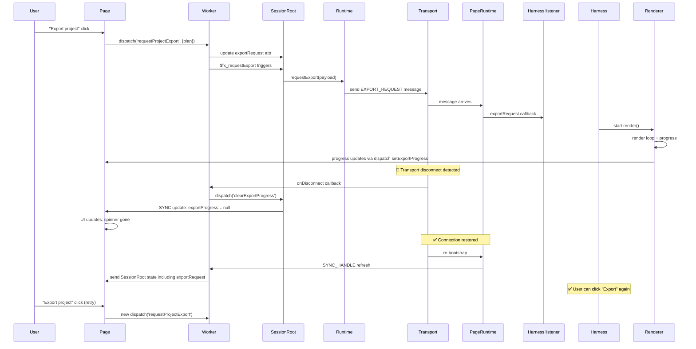

# Export Delivery Kontract — Minimal Approach

**Дата:** 9 мая 2026  
**Подход:** Простой и бесстрашный — нет retry логики, просто clear state при разрыве  
**Статус:** Спецификация для реализации

---

## 1. Текущее состояние (Current State)

### 1.1 Архитектура Export Channel

**Компоненты:**
- **Worker Runtime** (`createMiniCutDktRuntime.ts`): публикует EXPORT_REQUEST в канал
- **Page Runtime** (`createMiniCutPageSyncRuntime.ts`): слушает EXPORT_REQUEST и раздаёт listeners
- **Harness** (`createVideoEditorHarness.ts`): подписывается на export requests, запускает renderer
- **Model** (`SessionRoot.ts`): управляет `exportRequest` и `exportProgress` attrs

```
Worker Runtime
    ↓
    [Event: EXPORT_REQUEST]
         ↓
    Page Runtime (message router)
         ↓
    Harness (subscribeToExportRequests listener)
         ↓
    Renderer (render loop)
         ↓
    exportProgress updates via dispatch('setExportProgress', ...)
```

### 1.2 Текущий Flow (Before)

```mermaid
sequenceDiagram
    User->>Page: "Export project" click
    Page->>Worker: dispatch('requestProjectExport', {plan})
    Worker->>SessionRoot: update exportRequest attr
    Worker->>SessionRoot: $fx_requestExport triggers
    SessionRoot->>Runtime: requestExport(payload)
    Runtime->>Transport: send EXPORT_REQUEST message
    Transport->>PageRuntime: message arrives
    PageRuntime->>Harness listener: exportRequest callback
    Harness->>Renderer: start render()
    Renderer->>Renderer: render loop + progress
    Renderer->>Page: progress updates via dispatch setExportProgress
    
    Note over Transport,PageRuntime: ⚠️ If transport breaks here...
    Transport--❌: connection lost
    
    Note over Worker,SessionRoot: Worker state: exportRequest still pending
    Note over Harness: Harness: no in-flight request
    Note over Page: Page: progress frozen
```

**Проблема:** 
- Если транспорт разрывается между `EXPORT_REQUEST` и финалом `setExportProgress`, состояние рассинхронизируется
- Worker продолжает думать, что export в процессе (`exportRequest !== null`)
- Page не знает, что render порвался
- User видит зависший UI

### 1.3 Ключевые места в коде

**Worker — createMiniCutDktRuntime.ts (~L160)**
```typescript
// публикует event в канал
const publishExportRequest = (payload: ExportRequestState) => {
    for (const transport of transports) {
        transport.send({
            type: DKT_MSG.EXPORT_REQUEST,
            payload
        })
    }
}

// эффект в SessionRoot вызывает это
const requestExport = (payload: unknown) => {
    publishExportRequest(payload)
    // И больше ничего — fire-and-forget!
}
```

**Page — createMiniCutPageSyncRuntime.ts (~L290)**
```typescript
case DKT_MSG.EXPORT_REQUEST: {
    for (const listener of exportRequestListeners) {
        listener(message.payload)
    }
    break
}
```

**Harness — createVideoEditorHarness.ts (~L485)**
```typescript
const unlistenExportRequest = pageRuntime.subscribeExportRequests?.((payload) => {
    const request = parseExportRequest(payload)
    if (!request) return
    
    // Запускаем рендер
    startRequest(request)
    
    // В finally: очищаем local state
    dktPort.dispatch('consumeExportRequest', { id: request.id }, null)
}) ?? EMPTY_CLEANUP
```

**SessionRoot — SessionRoot.ts (L35, L38)**
```typescript
exportRequest: ['input', null as ExportRequestState | null],
exportProgress: ['input', null as ExportProgressState | null],
```

---

## 2. Проблемы и требования

### 2.1 Выявленные проблемы

| Проблема | Серьёзность | Сценарий | Текущее поведение |
|----------|-------------|---------|-------------------|
| State divergence на разрыве | HIGH | Transport breaks между EXPORT_REQUEST и setExportProgress | Worker: `exportRequest !== null`, Page: progress frozen |
| Нет recovery на reconnect | HIGH | Session loss (P2P fallback) | State не восстанавливается, user не знает о завислом export |
| Fire-and-forget без ACK | MEDIUM | Потеря message в пути | Нет способа узнать, дошла ли EXPORT_REQUEST до page |

### 2.2 Требования (Non-goals исключены)

✅ **ВКЛЮЧАЕМ:**
- Обнаруживать disconnect/reconnect события
- Очищать `exportProgress` при разрыве (чтобы UI не висела)
- Позволить user переклацать export после reconnect

❌ **НЕ ВКЛЮЧАЕМ:**
- Retry logic
- Recovery render из воркера
- Polling
- Complex state machine
- ACK на EXPORT_REQUEST
- Replay воркер-side экспорт-запроса

---

## 3. Предложенное решение (Solution)

### 3.1 Основная идея

**Правило:** На разрыве транспорта → dispatch action на очистку pending export state.

Нет retry, нет recovery — просто:
1. Transport detects disconnect
2. Dispatch `clearExportProgress` action to SessionRoot
3. Page UI обновляется (progress исчезает)
4. User может переклацать "Export" когда reconnect произойдёт
5. На reconnect: если worker state восстановится из SYNC, старый export request не повторится (stateless harness listener)

### 3.2 Flow после изменений (After)



### 3.3 State machine

```
┌─────────────────────────────────────────────────────────────┐
│ SessionRoot exportProgress state                            │
├─────────────────────────────────────────────────────────────┤
│                                                              │
│  null (idle)  ─ user clicks ─→  { stage, percent, ... }   │
│     ▲                                     │                 │
│     │                                     ↓                 │
│     │                          render in progress           │
│     │                                     │                 │
│     └─ setExportProgress ─────────────────┘                 │
│     │  (final update)                      │                 │
│     │                       transport disconnect detected   │
│     ├─ clearExportProgress ←─────────────────┘              │
│     │                                                        │
│     └─ OR render completes normally                          │
│        (setExportProgress → null)                            │
│                                                              │
└─────────────────────────────────────────────────────────────┘
```

---

## 4. Data Flow сравнение

### 4.1 Current Data Flow (ДО)

```
┌─────────────────────────────────┐
│ Worker SessionRoot              │
│ ─────────────────────────────   │
│ exportRequest: { id, plan }     │ ◄─── user action
│ exportProgress: null            │
└─────────────────────────────────┘
         │
         │ requestExport() [side effect]
         │
         ▼
┌──────────────────────────────────────┐
│ Transport Channel                    │
│ send EXPORT_REQUEST message          │ ◄─── FIRE-AND-FORGET
└──────────────────────────────────────┘      (no ACK)
         │
    ⚠️  │ [POTENTIAL BREAK POINT]
    ⚠️  │
         ▼
┌──────────────────────────────────────┐
│ Page Runtime MessageRouter           │
│ dispatch to subscribeExportRequests   │
└──────────────────────────────────────┘
         │
         ▼
┌──────────────────────────────────────┐
│ Harness Listener                     │
│ startRequest(exportRequest)          │
│ → Renderer.render() loop             │
└──────────────────────────────────────┘
         │
         ├─ render progress updates
         │
         ▼
┌──────────────────────────────────────┐
│ Page SessionRoot                     │
│ exportProgress: updated via dispatch  │
└──────────────────────────────────────┘

⚠️  PROBLEM: 
   If transport breaks between channel send and final setExportProgress update,
   exportProgress on Page is orphaned. Worker doesn't know, Page doesn't know.
```

### 4.2 New Data Flow (ПОСЛЕ)

```
┌─────────────────────────────────┐
│ Worker SessionRoot              │
│ ─────────────────────────────   │
│ exportRequest: { id, plan }     │ ◄─── user action
│ exportProgress: null            │
└─────────────────────────────────┘
         │
         │ requestExport() [side effect]
         │
         ▼
┌──────────────────────────────────────┐
│ Transport Channel                    │
│ send EXPORT_REQUEST message          │
└──────────────────────────────────────┘
         │
         ▼
┌──────────────────────────────────────┐
│ Page Runtime MessageRouter           │
│ dispatch to subscribeExportRequests   │
└──────────────────────────────────────┘
         │
         ▼
┌──────────────────────────────────────┐
│ Harness Listener                     │
│ startRequest(exportRequest)          │
│ → Renderer.render() loop             │
└──────────────────────────────────────┘
         │
         ├─ render progress updates
         │
         ▼
┌──────────────────────────────────────┐
│ Page SessionRoot                     │
│ exportProgress: updated via dispatch  │
└──────────────────────────────────────┘

    🔴 TRANSPORT DISCONNECT DETECTED
         │
         ▼
┌──────────────────────────────────────┐
│ Worker Transport.onDisconnect        │ ◄─── NEW
│ dispatch('clearExportProgress', {}) │
└──────────────────────────────────────┘
         │
         ▼
┌─────────────────────────────────┐
│ Worker SessionRoot              │
│ exportProgress: null ◄─ SET     │ ◄─── SYNCHRONIZED
│ exportRequest: { id, plan }     │
└─────────────────────────────────┘
         │
         │ SYNC from Worker to Page
         │
         ▼
┌─────────────────────────────────┐
│ Page SessionRoot                │
│ exportProgress: null ◄─ SET     │ ◄─── CLEARED
│ exportRequest: { id, plan }     │
└─────────────────────────────────┘
         │
         ▼
┌──────────────────────────────────────┐
│ Page UI                              │
│ ✅ Export spinner GONE               │ ◄─── USER SEES IMMEDIATE UPDATE
│ User can click "Export" again        │
└──────────────────────────────────────┘

    🔄 RECONNECT HAPPENS
         │
         ▼
┌──────────────────────────────────────┐
│ Worker & Page re-sync state          │ ◄─── FULL GRAPH REFRESH
│ exportRequest still exists           │
│ exportProgress: null                 │
└──────────────────────────────────────┘

    ✅ User can retry export
```

---

## 5. Step-by-Step Implementation Plan

### Шаг 1: Добавить action на очистку progress

**Файл:** `src/video-editor/models/SessionRoot/actions.ts`

**Что делать:** Добавить новый action `clearExportProgress` в список actions

```typescript
// В dktSessionActions добавить (после requestSelectedClipExport):

clearExportProgress: [
    {
        fn: () => ({
            exportProgress: null,
        }),
    },
],
```

**Зачем:** Action для очистки `exportProgress` state. Можно будет dispatch с worker'а.

---

### Шаг 2: Экспортировать action из runtime

**Файл:** `src/video-editor/dkt/runtime/createMiniCutDktRuntime.ts`

**Что делать:** Добавить helper функцию для dispatch `clearExportProgress`

**Код до:**
```typescript
// ~L160
const publishExportRequest = (payload: ExportRequestState) => {
    for (const transport of transports) {
        transport.send({
            type: DKT_MSG.EXPORT_REQUEST,
            payload
        })
    }
}
```

**Код после:**
```typescript
// ~L160
const publishExportRequest = (payload: ExportRequestState) => {
    for (const transport of transports) {
        transport.send({
            type: DKT_MSG.EXPORT_REQUEST,
            payload
        })
    }
}

// NEW: Clear export progress in all sessions
const clearExportProgressInAllSessions = () => {
    const sessions = Array.from(sessionRoots.values())
    for (const session of sessions) {
        if (session && typeof session.dispatchRootAction === 'function') {
            session.dispatchRootAction('clearExportProgress', {})
        }
    }
}
```

**Зачем:** Функция для dispatch action во все сессии. Вызовется при disconnect.

---

### Шаг 3: Добавить disconnect handler на транспорт

**Файл:** `src/video-editor/dkt/runtime/createMiniCutDktRuntime.ts`

**Что делать:** На каждый transport, когда он добавляется, подписаться на disconnect событие

**Код до:**
```typescript
// В addTransport или где регистрируется transport
transports.add(transport)
```

**Код после:**
```typescript
// В addTransport
transports.add(transport)

// NEW: subscribe to disconnect event
if (transport.onDisconnect && typeof transport.onDisconnect === 'function') {
    transport.onDisconnect(() => {
        debugExport('transport disconnect detected, clearing export progress')
        clearExportProgressInAllSessions()
    })
}
```

**Зачем:** Когда transport разрывается, сразу очищаем pending export state.

---

### Шаг 4: Убедиться, что transport имеет onDisconnect callback

**Файл:** `src/video-editor/dkt/transport/...` (найти где создаётся transport)

**Проверка:** Transport должен иметь метод `onDisconnect(callback)` или событие disconnect.

**Если нет:**

```typescript
// Добавить на transport wrapper
const transport = { 
    send: (msg) => { ... },
    // NEW:
    onDisconnect: (callback: () => void) => {
        // например, для postMessage:
        window.addEventListener('message', (e) => {
            if (e.data.type === 'TRANSPORT_DISCONNECTED') {
                callback()
            }
        })
        // или для WebSocket:
        // ws.addEventListener('close', callback)
    }
}
```

---

### Шаг 5: Action в DktSessionActionName type

**Файл:** `src/video-editor/models/SessionRoot/actions.ts`

**Что делать:** Добавить `clearExportProgress` в type `DktSessionActionName`

**Код:**
```typescript
export type DktSessionActionName =
    | 'handleInit'
    | 'createProject'
    | // ... остальные ...
    | 'setExportProgress'
    | 'clearExportProgress'  // ← NEW
    | 'consumeExportRequest'
```

**Зачем:** Type safety для dispatch.

---

### Шаг 6: (Optional) На Page: Логировать disconnect

**Файл:** `src/video-editor/app/createVideoEditorHarness.ts`

**Что делать:** Добавить listener на P2P_SESSION_LOST чтобы логировать

**Код:**
```typescript
// В messageRouter
case DKT_MSG.P2P_SESSION_LOST: {
    debugExport('P2P session lost, graph reset, export state will be cleared via worker action')
    // exportProgress уже будет очищен worker'ом через clearExportProgressInAllSessions()
    break
}
```

**Зачем:** Отладка + документация кода.

---

## 6. Проверка по шагам (Validation)

Ниже — как убедиться, что каждый шаг работает.

### Step 1 ✓ Action добавлена
```bash
# Проверить: action есть в SessionRoot/actions.ts
grep -n "clearExportProgress" src/video-editor/models/SessionRoot/actions.ts
```

### Step 2 ✓ Helper функция добавлена
```bash
# Проверить: функция есть в runtime
grep -n "clearExportProgressInAllSessions" src/video-editor/dkt/runtime/createMiniCutDktRuntime.ts
```

### Step 3 ✓ Disconnect handler подписан
```bash
# Проверить: handler вызывается на disconnect
grep -n "transport.onDisconnect" src/video-editor/dkt/runtime/createMiniCutDktRuntime.ts
```

### Step 4 ✓ Transport имеет onDisconnect
```bash
# Найти где создаётся transport, проверить сигнатуру
grep -rn "addTransport\|transport\s*=" src/video-editor/dkt/transport/
```

### Step 5 ✓ Type обновлена
```bash
# Проверить: clearExportProgress в type
grep -n "clearExportProgress" src/video-editor/models/SessionRoot/actions.ts | grep -E "type|DktSessionActionName"
```

### Step 6 ✓ Логирование добавлено
```bash
# Проверить: log message in harness
grep -n "P2P_SESSION_LOST\|export state will be cleared" src/video-editor/app/createVideoEditorHarness.ts
```

---

## 7. Тестирование (Testing Strategy)

### 7.1 Unit: Action работает

```typescript
// test/clearExportProgress.test.ts (новый файл или добавить в existing)

import { describe, it, expect } from 'vitest'
import { SessionRoot } from 'src/video-editor/models/SessionRoot'
import { dktSessionActions } from 'src/video-editor/models/SessionRoot/actions'

describe('clearExportProgress action', () => {
    it('should set exportProgress to null', () => {
        const action = dktSessionActions['clearExportProgress']?.[0]
        
        const stateBefore = {
            exportProgress: { stage: 'rendering', percent: 50 }
        }
        
        const result = action.fn({})
        
        expect(result).toEqual({
            exportProgress: null
        })
    })
})
```

### 7.2 Integration: Disconnect вызывает action

```typescript
// В createMiniCutDktRuntime.test.ts или новый файл

describe('transport disconnect → clearExportProgress', () => {
    it('should dispatch clearExportProgress when transport disconnects', async () => {
        const mockTransport = {
            send: vi.fn(),
            onDisconnect: vi.fn((callback) => {
                // store callback, call later
                mockTransport._disconnectCallback = callback
            })
        }
        
        const runtime = createMiniCutDktRuntime({ transport: mockTransport })
        
        // Simulate disconnect
        mockTransport._disconnectCallback?.()
        
        // Verify: action was dispatched
        // (проверить через spyOn на session.dispatchRootAction)
        expect(dispatchRootActionSpy).toHaveBeenCalledWith('clearExportProgress', {})
    })
})
```

### 7.3 E2E: User действия

```typescript
// В playwright tests или новый файл: export.e2e.ts

describe('Export UI handles transport disconnect', () => {
    it('should hide export progress when transport breaks', async () => {
        // 1. User clicks "Export"
        await page.click('[data-testid="export-button"]')
        
        // 2. Verify progress spinner appears
        const spinner = page.locator('[data-testid="export-progress"]')
        await expect(spinner).toBeVisible()
        
        // 3. Simulate transport disconnect (mock)
        await page.evaluate(() => {
            window.__testHarness?.simulateTransportDisconnect?.()
        })
        
        // 4. Wait a tick for dispatch
        await page.waitForTimeout(100)
        
        // 5. Verify progress spinner GONE
        await expect(spinner).not.toBeVisible()
        
        // 6. Verify UI is responsive (can click again)
        await page.click('[data-testid="export-button"]')
        // should work — no hang
    })
})
```

### 7.4 Smoke Test: Существующие export тесты не сломались

```bash
# Run existing export tests
npm run test:video-editor -- export

# All should pass
```

---

## 8. Rollout Plan

### Phase 1: Implement (1 PR)
- [ ] Step 1-6 above
- [ ] Unit tests pass
- [ ] No breaking changes to API

### Phase 2: Integration (1 commit/squash)
- [ ] E2E test added
- [ ] Existing export tests pass
- [ ] Manual smoke test: export works end-to-end

### Phase 3: Monitor (after merge)
- [ ] Check logs for `clearExportProgressInAllSessions` calls
- [ ] Verify no user complaints about hanging export UI
- [ ] If edge cases found, iterate with minimal changes

---

## 9. Summary: Changes Matrix

| File | Change | Lines | Complexity |
|------|--------|-------|------------|
| `SessionRoot/actions.ts` | Add `clearExportProgress` action | +4 | Very Low |
| `SessionRoot/actions.ts` | Add to `DktSessionActionName` type | +1 | Very Low |
| `createMiniCutDktRuntime.ts` | Add `clearExportProgressInAllSessions()` helper | +8 | Low |
| `createMiniCutDktRuntime.ts` | Add `transport.onDisconnect()` subscription | +5 | Low |
| `createVideoEditorHarness.ts` | Add debug log case (optional) | +2 | Very Low |
| **Tests** | Unit + Integration + E2E | +60-80 | Medium |
| **Total** | — | ~90 lines | **Low** |

---

## 10. Decisions Made

✅ **Решения, которые мы приняли:**

1. **NO retry logic** — render fails, it fails. User retries manually.
2. **NO complex recovery** — just clear state and sync.
3. **NO new transport protocol** — use existing disconnect event.
4. **Fire-and-forget EXPORT_REQUEST stays** — channel doesn't need ACK.
5. **Worker initiates clear** — not Page (simpler, worker is source of truth for sessions).

---

## 11. Ответы на вопросы

### Q: Что если render завершится ровно при disconnect?
**A:** Harness listener вызовет `consumeExportRequest` в finally, что dispatch `setExportProgress -> null`. Потом worker dispatch `clearExportProgress -> null`. Оба обновления к null — safe idempotent.

### Q: Что если user нажмёт "Export" дважды одновременно?
**A:** First dispatch создаёт exportRequest. Second dispatch – no-op (action не в списке). Harness listener один, он справится с одним request за раз. Safe.

### Q: Куда девается экспортированный файл если render порвался?
**A:** Renderer writes to disk incrementally. Partial file can be cleaned up by user or browser storage. Не наша проблема — user может переклацать.

### Q: А если P2P_SESSION_LOST произойдёт до EXPORT_REQUEST дошла до page?
**A:** Worker dispatch `clearExportProgress`, state очищается. Page reconnect получает синхронизированный state с exportProgress: null. User нажимает Export заново. Perfect.

---

## 12. References

- `src/video-editor/models/SessionRoot.ts` — Model definition
- `src/video-editor/models/SessionRoot/actions.ts` — Action definitions
- `src/video-editor/dkt/runtime/createMiniCutDktRuntime.ts` — Worker runtime
- `src/video-editor/dkt/runtime/createMiniCutPageSyncRuntime.ts` — Page runtime
- `src/video-editor/app/createVideoEditorHarness.ts` — Harness + export subscription
