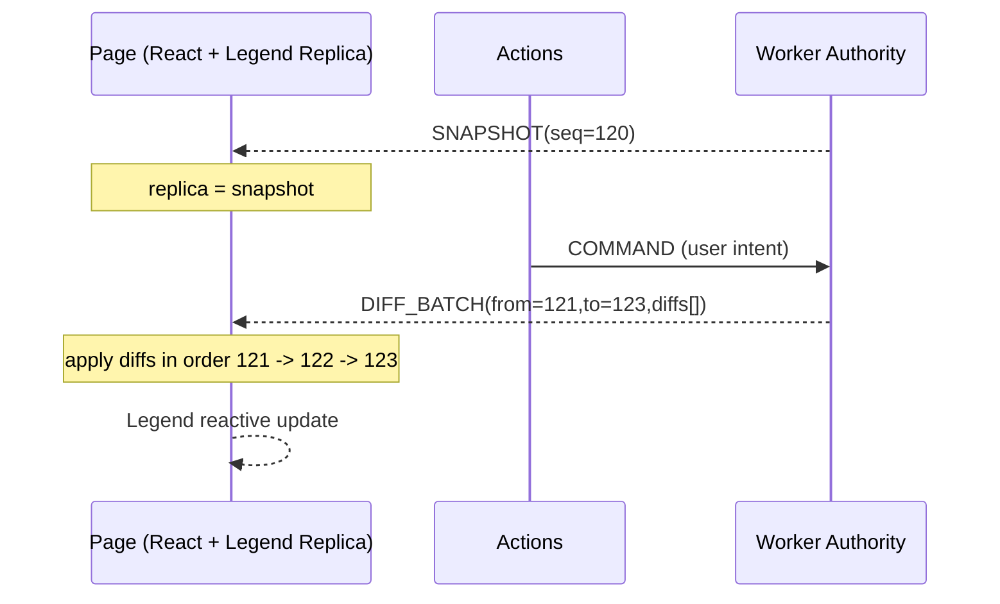
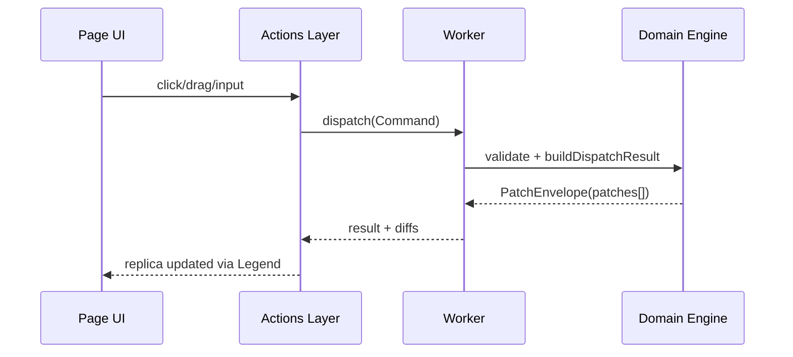
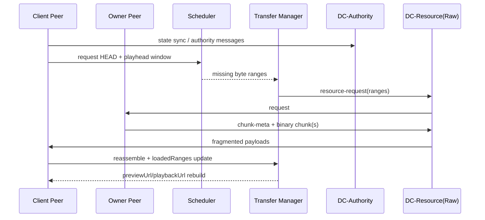

# MiniCut Architecture Review (Independent) - 2026-05-03

## Table of Contents
- [1. Architecture Ideas (Intent)](#1-architecture-ideas-intent)
- [2. Current Architecture Mapping](#2-current-architecture-mapping)
- [3. Data Model and Command/Patch Pipeline](#3-data-model-and-commandpatch-pipeline)
- [4. SharedWorker and P2P Replication](#4-sharedworker-and-p2p-replication)
- [5. Idea 2 Fit: Graph attrs/rels](#5-idea-2-fit-graph-attrsrels)
- [5.1 Factual Review: Numeric Dictionary + Batching](#51-factual-review-numeric-dictionary--batching)
- [6. Idea 4 Fit: Legend-State Native Usage](#6-idea-4-fit-legend-state-native-usage)
- [7. Mermaid Architecture Flows](#7-mermaid-architecture-flows)
- [8. Risks and Recommendations](#8-risks-and-recommendations)
- [9. Key Source Files](#9-key-source-files)

## 1. Architecture Ideas (Intent)

### Idea 1
Choose the right business-level data model shape: convenient for editing, and stable for rendering/export.

### Idea 2
Represent data as a graph where nodes contain `attrs` and `rels` (named adjacency lists). This enables:
- Cheap diff for rendering and replication.
- Replication through `SharedWorker`.
- P2P replication using the same semantic model.
- Optional protocol compaction with a numeric dictionary (op/field ids) and serial diff batching.

### Idea 3
Build P2P with media/file transfer, including large-file behavior where preview works immediately via range/window loading.

### Idea 4
Use Legend State in a native way, with minimal extra orchestration around what Legend already does well.

## 2. Current Architecture Mapping

The current implementation is authority-centric with patch-based replication:
- UI emits business commands.
- Authority layer validates commands and produces patch envelopes.
- Store applies patches reactively.
- Render/export read deterministic snapshots and derived projections.

This is a practical architecture for consistency and replayability.

## 3. Data Model and Command/Patch Pipeline

Model shape:
- `ProjectRegistry` with `projects`, `entitiesById`, `activeProjectId`.
- Entity graph with `project/timeline/track/clip/resource/effect/keyframe`.
- Each entity follows `id + type + attrs + rels`.

Command side:
- Commands (`CMD.*`) encode business operations (`PROJECT_CREATE`, `RESOURCE_IMPORT`, timeline and clip operations, effect operations).
- `buildDispatchResult` validates and transforms commands into `PatchEnvelope`.

Patch side:
- Patch vocabulary (`PATCH.*`) includes `ENTITY_SET`, `ATTRS_MERGE`, `SCALAR_SET`, `REL_SPLICE`, etc.
- Same patch semantics are used across local authority, SharedWorker authority, and P2P authority transport.

Overall: this strongly supports Idea 1 and most of Idea 2.

## 4. SharedWorker and P2P Replication

SharedWorker:
- Acts as a browser-local authority for multi-tab consistency.
- Applies command results in-place and broadcasts patch envelopes.
- Maintains undo/redo stacks.

P2P:
- `PageP2PManager` handles role election (`server/client`), signaling, transport setup, and failover/session-loss callbacks.
- Authority transport and media transport are separated.
- Raw DataChannel binary fragmentation/reassembly addresses cross-browser message-size constraints.

Media transfer:
- Progressive strategy: head preview, playhead window requests, tail fallback, sequential fill.
- Supports practical large-file preview behavior.

Overall: Idea 3 is implemented at a high maturity level.

## 5. Idea 2 Fit: Graph attrs/rels

Fit assessment: high.

What matches well:
- Graph entity model is central.
- Named relation lists (`rels`) encode graph edges.
- Patch operations map naturally to graph mutations.

Current limitations:
- Not a conflict-free multi-writer CRDT graph.
- No first-class causal metadata (`opId`, vector/Lamport metadata) in patch envelopes.
- Undo/redo currently relies on snapshot rollback in authority runtime.

Verdict:
- Excellent fit for authority-based replication.
- Partial fit for fully decentralized multi-writer semantics.

## 5.1 Factual Review: Numeric Dictionary + Batching

Current factual state:
- Batching already exists at the patch-envelope level (`PatchEnvelope.patches[]`) and is applied in batched reactive updates.
- Diff semantics are serial in practice per authority stream, but there is no explicit global diff sequence contract (`seq`, `fromSeq`, `toSeq`) in protocol messages.
- Control payloads and patch ops are string-keyed today (readable, debuggable), not dictionary-compressed.

Review conclusion:
- Idea 2 is already strong on graph shape and batched patch application.
- The missing piece for Idea 2 maturity is transport-level compaction and strict serial replay metadata.

Compact proposal:
- Add an optional numeric dictionary codec for wire format only (keep in-memory/domain format unchanged).
- Add serial metadata (`baseSeq`, `fromSeq`, `toSeq`) to each batched diff packet.
- Keep backward compatibility via protocol capability flags.

## 6. Idea 4 Fit: Legend-State Native Usage

Fit assessment: medium-high.

What matches well:
- Direct use of Legend primitives (`observable`, `computed`, batched updates, optimized list rendering).
- Selector-driven narrow reads in many UI paths.

Pressure points:
- Growing custom orchestration around authority and transfer subsystems can increase cognitive overhead.
- Some broad observer scopes can increase rerender blast radius.

Verdict:
- The code is mostly aligned with Legend-native patterns.
- Requires discipline to avoid over-wrapping over time.

## 7. Mermaid Architecture Flows

### 7.1 Worker <-> Page Replica Loop (Snapshot + Serial Diffs)



### 7.2 Compact Serial Diff Packet (Idea 2 Extension)

Dictionary (wire codec example):

| Code | Meaning |
| --- | --- |
| `0` | `ENTITY_SET` |
| `1` | `ATTRS_MERGE` |
| `2` | `SCALAR_SET` |
| `3` | `REL_SPLICE` |

| Key | Meaning |
| --- | --- |
| `0` | `entityId` |
| `1` | `path` |
| `2` | `value` |
| `3` | `index` |
| `4` | `deleteCount` |
| `5` | `items` |

Serialized examples (compact JSON):

```json
{
  "fromSeq": 121,
  "toSeq": 123,
  "diffs": [
    { "s": 121, "o": 2, "a": ["clip:1", "transform.x.value", 42] },
    { "s": 122, "o": 1, "a": ["clip:1", { "color": "#FF6B6B" }] },
    { "s": 123, "o": 3, "a": ["track:v1", 4, 1, ["clip:9"]] }
  ]
}
```

Explanation:
- `s`: per-diff sequence number.
- `o`: numeric op code from dictionary.
- `a`: ordered arguments (`entityId`, `path/value`, or splice tuple).
- Order is the source of truth: replay strictly by ascending `s`.

### 7.3 Actions -> Worker Command Path



### 7.4 Compact WebRTC File + Preview Transfer



## 8. Risks and Recommendations

Top risks:
- Authority undo memory growth from snapshot stacks.
- Patch protocol evolution without explicit version/capability contracts.
- Potential gradual over-wrapping around Legend usage patterns.

Recommended actions:
- Add explicit protocol versioning for patch and transfer control messages.
- Add authority memory telemetry and undo budget caps.
- Add profiling guardrails for observer scope and rerender counts.
- Optionally introduce operation metadata (`opId`, `originPeerId`, `createdAt`) for diagnostics/replay.

## 9. Key Source Files

Business model and commands:
- [src/video-editor/domain/types.ts](../src/video-editor/domain/types.ts)
- [src/video-editor/domain/createProject.ts](../src/video-editor/domain/createProject.ts)
- [src/video-editor/domain/applyCommand.ts](../src/video-editor/domain/applyCommand.ts)
- [src/video-editor/domain/validateCommand.ts](../src/video-editor/domain/validateCommand.ts)
- [src/video-editor/domain/applyPatch.ts](../src/video-editor/domain/applyPatch.ts)
- [src/video-editor/domain/applyPatchInPlace.ts](../src/video-editor/domain/applyPatchInPlace.ts)
- [src/video-editor/domain/selectors.ts](../src/video-editor/domain/selectors.ts)

Legend store and derived:
- [src/video-editor/legend/projectStore.ts](../src/video-editor/legend/projectStore.ts)
- [src/video-editor/legend/observableSelectors.ts](../src/video-editor/legend/observableSelectors.ts)
- [src/video-editor/legend/derivedTimeline.ts](../src/video-editor/legend/derivedTimeline.ts)

Authority and replication:
- [src/video-editor/app/createVideoEditorHarness.ts](../src/video-editor/app/createVideoEditorHarness.ts)
- [src/video-editor/worker/sharedWorker.ts](../src/video-editor/worker/sharedWorker.ts)
- [src/video-editor/worker/sharedWorkerClient.ts](../src/video-editor/worker/sharedWorkerClient.ts)
- [src/video-editor/worker/derivedIndexes.ts](../src/video-editor/worker/derivedIndexes.ts)
- [src/video-editor/p2p/PageP2PManager.ts](../src/video-editor/p2p/PageP2PManager.ts)
- [src/video-editor/p2p/P2PAuthorityAdapter.ts](../src/video-editor/p2p/P2PAuthorityAdapter.ts)

Related docs:
- [docs/business-logic-data-flow-en-2026-05-03.md](business-logic-data-flow-en-2026-05-03.md)
- [docs/runtime-trace-import-cut-effect-export-en-2026-05-03.md](runtime-trace-import-cut-effect-export-en-2026-05-03.md)
- [docs/test-coverage-review-en-2026-05-03.md](test-coverage-review-en-2026-05-03.md)
