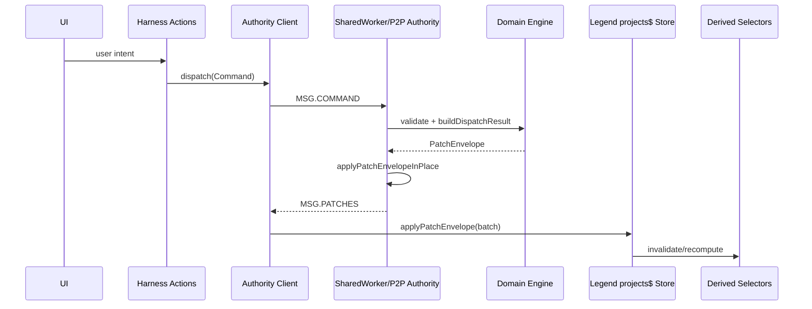
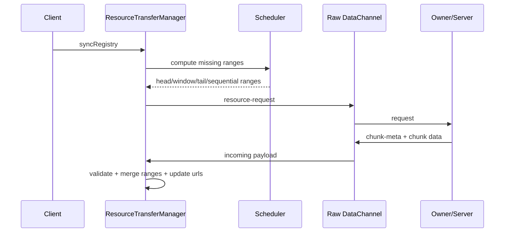

# MiniCut Business Logic Data Flow (Project/Timeline Core) - 2026-05-03

## Table of Contents
- [1. Scope and Layers](#1-scope-and-layers)
- [2. Entity Model and Graph Relations](#2-entity-model-and-graph-relations)
- [3. Action/Command Dictionary](#3-actioncommand-dictionary)
- [4. Patch Protocol and Store Reactivity](#4-patch-protocol-and-store-reactivity)
- [5. Derived State and Indexes](#5-derived-state-and-indexes)
- [6. Mermaid Flows](#6-mermaid-flows)
- [7. Key Source Files](#7-key-source-files)

## 1. Scope and Layers

This document describes runtime data flow inside the business logic of the video project:
- Entity graph and registry.
- Actions/commands and patch generation.
- Reactive store updates and derived projections.
- Runtime indexes used for faster command processing.

Layer map:
- UI action facade (`createVideoEditorHarness`).
- Domain command engine (`applyCommand` + validators).
- Authority runtime (SharedWorker and/or P2P authority transport).
- Legend store and computed selectors.
- Render/export consumers.

## 2. Entity Model and Graph Relations

Core shape:
- `ProjectRegistry`
  - `projects` (project roots and versions)
  - `entitiesById` (all nodes)
  - `activeProjectId`

Entity node structure:
- `Entity { id, type, attrs, rels }`

Primary node types:
- `project`, `timeline`, `track`, `clip`, `resource`, `effect`, `keyframe`

Relation examples:
- `project.rels.timelines[]`, `project.rels.resources[]`, `project.rels.activeTimeline`
- `timeline.rels.tracks[]`
- `track.rels.clips[]`
- `clip.rels.resource`, `clip.rels.effects[]`

## 3. Action/Command Dictionary

Command contracts (`CMD.*`):
- Project: `PROJECT_CREATE`
- Resource: `RESOURCE_IMPORT`
- Timeline structure: `TRACK_CREATE`, `TIMELINE_ADD_CLIP`, `TIMELINE_MOVE_CLIP`, `TIMELINE_SPLIT_CLIP`, `TIMELINE_DELETE_CLIP`
- Clip attrs: `CLIP_UPDATE_ATTRS`
- Effects: `EFFECT_ADD`, `EFFECT_REMOVE`

Action facade in harness (`actions.*`) maps UI intent to commands, for example:
- `createProject`, `setActiveProject`
- `importFiles`, `addResourceToTimeline`, `addTrack`
- `renameSelectedClip`, `colorSelectedClip`, `updateSelectedClipOpacity`
- `updateSelectedClipFade`, trim/split/delete helpers
- `undo`, `redo`, playback/session controls

## 4. Patch Protocol and Store Reactivity

Patch contracts (`PATCH.*`):
- `REGISTRY_SET`
- `PROJECT_SET`
- `ENTITY_SET`
- `ENTITY_DELETE`
- `ATTRS_MERGE`
- `SCALAR_SET`
- `REL_SPLICE`
- `WORKSPACE_ACTIVE_PROJECT_SET`

Flow summary:
- `dispatch(command)` -> `buildDispatchResult` -> `PatchEnvelope(version, patches[])`.
- Authority applies patches in runtime state.
- Patch stream is pushed to clients.
- Legend `projects$` applies patches in a `batch`.

Reactivity behavior:
- `ENTITY_SET` invalidates the updated node and downstream derivations.
- `ATTRS_MERGE` invalidates touched attrs branch.
- `REL_SPLICE` invalidates relation list, affecting ordering/list views.
- `SCALAR_SET` invalidates exact scalar path.
- Session fields (`cursor`, `selectedEntityId`, `timelineZoom`) drive focused UI recomputation.

## 5. Derived State and Indexes

Selector layer:
- `observableSelectors.ts` provides typed observable access (`attrs$`, `rels$`, `get*Ids$`).

Derived layer:
- `derivedTimeline.ts` computes clip intervals, playback duration, and preview projections.

Runtime indexes:
- Worker indexes in `derivedIndexes.ts`:
  - `clipTrackById`
  - `effectsByClipId`
  - `clipIntervals` (sorted)
- Domain dispatch accepts optional context indexes for faster lookup.

Practical note:
- Direct `entitiesById` lookup gives O(1) for node retrieval.
- Some reverse-link lookups still require scans (e.g., clip-to-track fallback paths).

## 6. Mermaid Flows

### 6.1 Command to Reactive Store



### 6.2 Entity Graph Relations

```mermaid
flowchart TD
  PG[ProjectGraph]
  P[Entity project]
  T[Entity timeline]
  TV[Entity track video]
  TA[Entity track audio]
  C[Entity clip]
  R[Entity resource]
  E[Entity effect]
  K[Entity keyframe]

  PG -->|rootEntityId| P
  P -->|timelines[]| T
  P -->|activeTimeline| T
  P -->|resources[]| R
  T -->|tracks[]| TV
  T -->|tracks[]| TA
  TV -->|clips[]| C
  TA -->|clips[]| C
  C -->|resource| R
  C -->|effects[]| E
  C -->|animated scalars -> keyframes[]| K
```

### 6.3 Media Transfer Data Flow (P2P)



## 7. Key Source Files

Business model and commands:
- [src/video-editor/domain/types.ts](../src/video-editor/domain/types.ts)
- [src/video-editor/domain/createProject.ts](../src/video-editor/domain/createProject.ts)
- [src/video-editor/domain/applyCommand.ts](../src/video-editor/domain/applyCommand.ts)
- [src/video-editor/domain/validateCommand.ts](../src/video-editor/domain/validateCommand.ts)
- [src/video-editor/domain/applyPatch.ts](../src/video-editor/domain/applyPatch.ts)
- [src/video-editor/domain/applyPatchInPlace.ts](../src/video-editor/domain/applyPatchInPlace.ts)
- [src/video-editor/domain/selectors.ts](../src/video-editor/domain/selectors.ts)

Legend reactivity:
- [src/video-editor/legend/projectStore.ts](../src/video-editor/legend/projectStore.ts)
- [src/video-editor/legend/sessionStore.ts](../src/video-editor/legend/sessionStore.ts)
- [src/video-editor/legend/observableSelectors.ts](../src/video-editor/legend/observableSelectors.ts)
- [src/video-editor/legend/derivedTimeline.ts](../src/video-editor/legend/derivedTimeline.ts)

Authority and replication:
- [src/video-editor/app/createVideoEditorHarness.ts](../src/video-editor/app/createVideoEditorHarness.ts)
- [src/video-editor/worker/sharedWorker.ts](../src/video-editor/worker/sharedWorker.ts)
- [src/video-editor/worker/sharedWorkerClient.ts](../src/video-editor/worker/sharedWorkerClient.ts)
- [src/video-editor/worker/derivedIndexes.ts](../src/video-editor/worker/derivedIndexes.ts)
- [src/video-editor/p2p/P2PAuthorityAdapter.ts](../src/video-editor/p2p/P2PAuthorityAdapter.ts)
- [src/video-editor/p2p/PageP2PManager.ts](../src/video-editor/p2p/PageP2PManager.ts)
- [src/video-editor/media/resourceTransferManager.ts](../src/video-editor/media/resourceTransferManager.ts)
- [src/video-editor/media/resourceTransferScheduler.ts](../src/video-editor/media/resourceTransferScheduler.ts)

Related docs:
- [docs/architecture-review-en-2026-05-03.md](architecture-review-en-2026-05-03.md)
- [docs/test-coverage-review-en-2026-05-03.md](test-coverage-review-en-2026-05-03.md)
