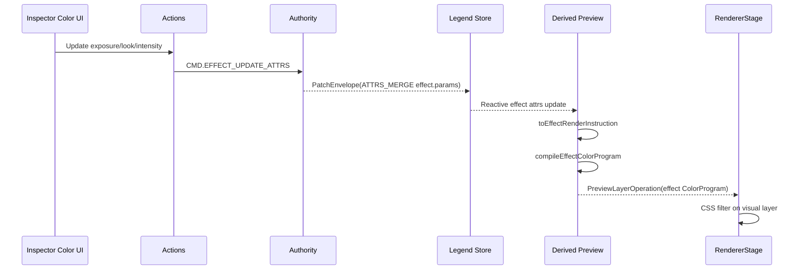
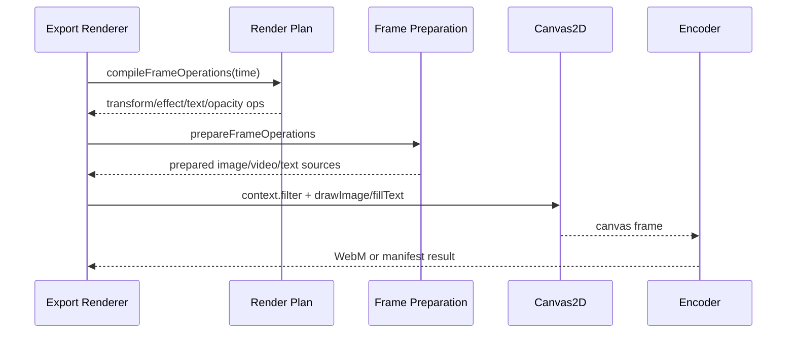
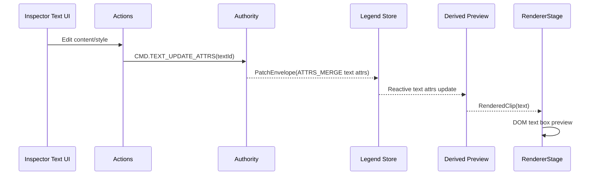

# MiniCut Color Grading and Text Architecture - 2026-05-04

## Table of Contents
- [1. Scope and Verdict](#1-scope-and-verdict)
- [2. Current Color Grading Architecture](#2-current-color-grading-architecture)
- [3. GPU, LUT, and Linear RGB Trade-off](#3-gpu-lut-and-linear-rgb-trade-off)
- [4. Preview Implications](#4-preview-implications)
- [5. Current Text Architecture](#5-current-text-architecture)
- [6. TextClip Model Decision](#6-textclip-model-decision)
- [7. Recommended Evolution](#7-recommended-evolution)
- [8. Architecture Flows](#8-architecture-flows)
- [9. Key Source Files](#9-key-source-files)

## 1. Scope and Verdict

This document describes how color grading, media transforms, text editing, and text rendering are implemented today. It also answers two architecture questions:

- Would replacing the current CSS-filter color path with a GPU/LUT/linear-RGB pipeline be beneficial?
- Is the current `clip + text entity` model better or worse than a separate `TextClip` entity type?

Short verdict:

- The current CSS-filter pipeline is the right baseline for the current product stage. It is simple, fast, testable, and works in preview and export.
- A GPU/LUT/linear-RGB pipeline would be valuable later for real curves, color wheels, 3D LUTs, scopes based on final pixels, and higher-fidelity export. It should not replace the current path immediately.
- In preview, GPU processing would help only if the product needs high-fidelity grading feedback. For current exposure/contrast/saturation/temperature looks, CSS filters are good enough and avoid major complexity.
- The current `clip` plus linked `text` entity is the better graph-model choice. It preserves one timeline clip abstraction while keeping text content/style as a reusable, independently patchable entity.

Recommended direction:

- Keep CSS filters as the default baseline.
- Keep the shared typed color program boundary.
- Add GPU/LUT as an optional backend when the feature set requires it, not as a rewrite prerequisite.
- Keep `clip.rels.text -> text entity`; optionally add TypeScript discriminated view types for better developer ergonomics.

## 2. Current Color Grading Architecture

### Data Model

Media transform is a first-class clip attribute:

- `ClipAttrs.transform.x`
- `ClipAttrs.transform.y`
- `ClipAttrs.transform.scale`
- `ClipAttrs.transform.rotation`

Color grading is stored as a clip effect:

- `EffectAttrs.kind = 'color-correction'`
- `EffectAttrs.params` stores `ColorCorrectionAttrs`
- Effects are attached through `clip.rels.effects`

This means transform belongs to clip identity and timing, while color belongs to the effect stack. That is a good separation:

- Transform is expected on every visual clip.
- Color is optional, stackable, bypassable, and reorderable with other effects.

### Command Path

The UI does not mutate arbitrary render objects directly. It dispatches business actions that produce domain commands:

- Transform changes dispatch `CMD.CLIP_UPDATE_ATTRS`.
- Adding primary correction dispatches `CMD.EFFECT_ADD` with `kind: 'color-correction'`.
- Color slider and look changes dispatch `CMD.EFFECT_UPDATE_ATTRS`.

The authority validates commands and emits patch envelopes. Legend State applies patches and recomputes derived preview projections.

### Derived Preview Path

The reactive preview path is:

1. Timeline clip intervals are selected at the current cursor.
2. Clip attrs, resource attrs, text attrs, effects, transform, opacity, and fades are read through narrow observable selectors.
3. Effects are converted into `EffectRenderInstruction` values.
4. Color effects are compiled into `ColorProgram` operations.
5. The preview renderer turns those operations into CSS filters.

The key architectural boundary is `ColorProgram`. It gives the product a typed representation that can later target CSS filters, Canvas2D, WebGL, WebGPU, or CPU pixel math without changing the data model.

### Preview Renderer

The main preview uses DOM media elements for real visual clips:

- Image clips render as ``.
- Video clips render as `<video>`.
- Text clips render as DOM text boxes.
- Effects compile to CSS filter strings applied to the visual layer.
- Transform compiles to CSS transform on the layer.

There is also an OffscreenCanvas fallback/summary worker for lightweight preview drawing, but it is not a full media/color engine.

### Export Renderer

Export uses the deterministic frame operation path:

1. `compileFrameOperations` produces per-frame operations.
2. `prepareFrameOperations` loads/seeks image/video resources.
3. `drawPreparedFrameOperations` draws to Canvas2D.
4. Canvas2D `context.filter` applies the compiled color filters.
5. Video export encodes with WebCodecs or MediaRecorder when available.

This is important: preview and export are not the exact same renderer, but they share the same domain model and color compilation semantics.

## 3. GPU, LUT, and Linear RGB Trade-off

### What the Current CSS Path Does Well

For the current color feature set, CSS filters are a strong baseline:

- Exposure maps to `brightness()`.
- Contrast maps to `contrast()`.
- Saturation maps to `saturate()`.
- Hue maps to `hue-rotate()`.
- Warm temperature maps to extra saturation and sepia.
- Cool temperature maps to hue shift.

Benefits:

- Very low implementation cost.
- Browser optimized.
- Easy to inspect in Playwright.
- Easy to test as strings and computed styles.
- Works for preview video without copying every frame through JavaScript.
- Works for Canvas2D export through `context.filter`.
- Good enough for simple look presets and interactive UI feedback.

### Where CSS Filters Are Not Enough

CSS filters are not a professional grading engine. They are limited when the product needs:

- Accurate linear-light math.
- Curves with channel-specific transfer functions.
- Lift/gamma/gain or shadows/mids/highs controls.
- Secondary corrections with masks and qualifiers.
- 3D LUTs with trilinear interpolation.
- Color-managed preview/export parity.
- Scopes sampled from the final post-grade frame buffer.
- Strong guarantees that preview and export match pixel-for-pixel.

CSS filter order and browser behavior are also not a good foundation for advanced color science.

### Would a GPU/LUT/Linear-RGB Rewrite Help Now?

For the current product stage: only partially.

It would help if the next features are curves, LUT import, color wheels, and final-frame scopes. It would not help much if the product stays with exposure/contrast/saturation/temperature presets.

Costs of doing it now:

- More renderer complexity.
- More browser compatibility work.
- More snapshot and visual-diff test infrastructure.
- More difficult P2P preview behavior when media is partially loaded.
- More difficult export parity, because the export path must use the same math backend or a faithful fallback.
- Higher risk of introducing performance regressions on low-end devices.

Recommendation: do not rewrite the current CSS path now. Add a backend abstraction and introduce GPU/LUT only as an optional high-fidelity backend once features require it.

### Practical Decision Matrix

| Need | Current CSS path | GPU/LUT/linear-RGB path |
| --- | --- | --- |
| Basic look presets | Good | Overkill |
| Live preview responsiveness | Good | Good if implemented carefully |
| Browser compatibility | Strong | Medium |
| Test simplicity | Strong | Medium/low |
| Curves | Weak | Strong |
| 3D LUT | Not suitable | Strong |
| Color wheels | Weak | Strong |
| Pixel-accurate scopes | Weak | Strong |
| Export parity | Acceptable baseline | Strong but harder |
| Implementation risk | Low | High |

## 4. Preview Implications

### Would GPU Processing Work in Preview?

Yes, but the preview architecture would need a different rendering surface.

The current real preview uses DOM elements. CSS filters are cheap because the browser applies them directly to `<video>` and `` layers. A GPU color pipeline would likely require one of these approaches:

1. Draw every video frame into a WebGL/WebGPU canvas, run shader passes, then composite.
2. Keep DOM preview as default and use GPU only for high-fidelity compare/export preview modes.
3. Use WebCodecs `VideoFrame` where available and fall back to DOM/CSS filters elsewhere.

Approach 1 gives maximum control but is the largest rewrite. Approach 2 is the safest incremental path.

### Why CSS Preview Is Still Valuable

CSS preview is not a throwaway solution. It is the right fast path for:

- Simple grade controls.
- Clip transforms.
- Split compare.
- Interactive sliders.
- Browser integration tests.
- P2P preview while media ranges are still loading.

The current split compare also relies on DOM video plus a canvas snapshot for the before side. This keeps one synced video element and avoids duplicate video playback work.

### Recommended Preview Strategy

Use two quality tiers:

- Draft preview: current DOM/CSS filter path.
- High-fidelity preview: future WebGL/WebGPU canvas path, enabled only when needed by advanced grade operations.

The UI can expose this later as a quality setting or activate it automatically when a clip uses GPU-only effects such as LUT or curves.

## 5. Current Text Architecture

### Data Model

Text is represented as two graph nodes:

- A normal `clip` entity on the timeline.
- A linked `text` entity containing content, style, and box attributes.

The clip carries timeline semantics:

- start
- duration
- in point
- opacity
- fade in/out
- transform
- track membership
- selection identity

The text entity carries text semantics:

- content
- font family
- font size
- font weight
- line height
- letter spacing
- text color
- background color
- alignment
- text box width/height

The link is `clip.rels.text`.

### Editing Path

The inspector reads the selected clip. If the selected clip has `rels.text`, it shows the text section.

Text edits dispatch `CMD.TEXT_UPDATE_ATTRS`, which patches only the `text` entity. The selected clip identity stays stable. Preview updates because derived preview state reads `textAttrs$` through Legend selectors.

### Preview Rendering

Text preview is DOM-based:

- The renderer creates a text box layer.
- Text style maps to DOM style properties.
- The text box supports multiline content through `white-space: pre-wrap`.
- The same clip-level opacity and transform system applies to text clips.

This makes text editing responsive and browser-native in preview.

### Export Rendering

Export uses Canvas2D:

- The export renderer reads the same frame operation text payload.
- It draws optional background rectangles.
- It splits content by newline.
- It renders each line with `context.fillText`.

The result is a deterministic export path while keeping preview lightweight.

## 6. TextClip Model Decision

### Option A: Separate `TextClip` Entity Type

This would make timeline entities split into different clip-like types, for example:

- `videoClip`
- `audioClip`
- `imageClip`
- `textClip`

Benefits:

- Stronger TypeScript discrimination at the entity type level.
- Text-specific fields can live directly on the clip-like entity.
- Some UI code can branch by entity type instead of relation presence.

Costs:

- More timeline code paths.
- More command validation branches.
- More render-plan branches.
- More patch migration complexity.
- Harder shared behavior for trim, split, move, opacity, fade, transform, selection, and track ordering.

### Option B: Current `clip + text entity`

Benefits:

- One timeline abstraction for all clip kinds.
- Shared trim/split/move/fade/opacity/transform behavior.
- Text content/style can be patched independently from timeline placement.
- The graph model stays consistent: attrs hold data, rels hold links.
- Future reuse is easier, such as multiple clips referencing the same title template or duplicated title content.
- Better fit for authority replication, because text edits are small `ATTRS_MERGE` patches on the text node.

Costs:

- TypeScript needs helper selectors or view models to avoid repeated `rels.text` checks.
- Developers must remember that a text clip is identified by `clip.attrs.mediaKind === 'text'` or `clip.rels.text`.
- Some validation rules must keep clip/text relations consistent.

### Recommendation

Keep the current model.

The better refinement is not a new persisted `TextClip` entity type. The better refinement is a typed view over the existing graph, for example:

```ts
type TimelineClipView =
  | { kind: 'video'; clip: ClipAttrs; resource: ResourceAttrs }
  | { kind: 'image'; clip: ClipAttrs; resource: ResourceAttrs }
  | { kind: 'audio'; clip: ClipAttrs; resource: ResourceAttrs }
  | { kind: 'text'; clip: ClipAttrs; text: TextAttrs }
```

This preserves the storage model and improves developer ergonomics.

## 7. Recommended Evolution

### Near Term

- Keep CSS filters for primary correction and look presets.
- Keep text preview as DOM and export as Canvas2D.
- Keep `clip + text entity` as the persisted graph model.
- Add focused tests around preview/export parity for text content, multiline text, transform, and color filters.
- Keep look intensity and split compare covered by Playwright, because those are interaction-sensitive paths.

### Medium Term

- Normalize all color operations into a typed `ColorProgram` that contains enough information for non-CSS backends.
- Add a CPU pixel-math implementation for selected operations where Canvas2D filters are insufficient.
- Add visual snapshot tests for representative clips and looks.
- Add a typed timeline clip view layer to remove repeated relation checks in UI/render code.
- Add explicit validation for text clip invariants: text clips must have `rels.text`, media clips must have `rels.resource`.

### Later

- Add WebGL/WebGPU backend for curves, LUT, and color wheels.
- Add `.cube` parser and LUT resources/entities.
- Add final-frame scopes from sampled post-render pixels.
- Add export fallback parity tests that compare CSS/Canvas and GPU/CPU outputs within tolerance.

The architecture should evolve by adding backends behind the current command/model/render-plan boundaries, not by replacing the whole editor pipeline.

## 8. Architecture Flows

### 8.1 Color Grade Preview Flow



### 8.2 Export Color Flow



### 8.3 Text Editing Flow



## 9. Key Source Files

Domain model and commands:

- [src/video-editor/domain/types.ts](../src/video-editor/domain/types.ts)
- [src/video-editor/domain/applyCommand.ts](../src/video-editor/domain/applyCommand.ts)
- [src/video-editor/domain/validateCommand.ts](../src/video-editor/domain/validateCommand.ts)

Derived preview and render plans:

- [src/video-editor/legend/derivedTimeline.ts](../src/video-editor/legend/derivedTimeline.ts)
- [src/video-editor/render/renderPlan.ts](../src/video-editor/render/renderPlan.ts)
- [src/video-editor/render/previewRenderPlan.ts](../src/video-editor/render/previewRenderPlan.ts)

Color pipeline:

- [src/video-editor/render/colorPipeline.ts](../src/video-editor/render/colorPipeline.ts)
- [src/video-editor/render/colorProgram.ts](../src/video-editor/render/colorProgram.ts)
- [src/video-editor/color/looks.ts](../src/video-editor/color/looks.ts)
- [src/video-editor/color/oklch.ts](../src/video-editor/color/oklch.ts)

Preview UI:

- [src/video-editor/ui/Inspector.tsx](../src/video-editor/ui/Inspector.tsx)
- [src/video-editor/ui/LookBrowser.tsx](../src/video-editor/ui/LookBrowser.tsx)
- [src/video-editor/ui/PreviewPanel.tsx](../src/video-editor/ui/PreviewPanel.tsx)
- [src/video-editor/ui/RendererStage.tsx](../src/video-editor/ui/RendererStage.tsx)
- [src/video-editor/ui/TextAppearancePanel.tsx](../src/video-editor/ui/TextAppearancePanel.tsx)
- [src/video-editor/ui/OklchColorField.tsx](../src/video-editor/ui/OklchColorField.tsx)

Export rendering:

- [src/video-editor/render/frameRenderer.ts](../src/video-editor/render/frameRenderer.ts)
- [src/video-editor/render/exportRenderer.ts](../src/video-editor/render/exportRenderer.ts)

Tests:

- [src/video-editor/tests/video-editor.happy-path.test.tsx](../src/video-editor/tests/video-editor.happy-path.test.tsx)
- [tests/integration/video-editor.spec.ts](../tests/integration/video-editor.spec.ts)