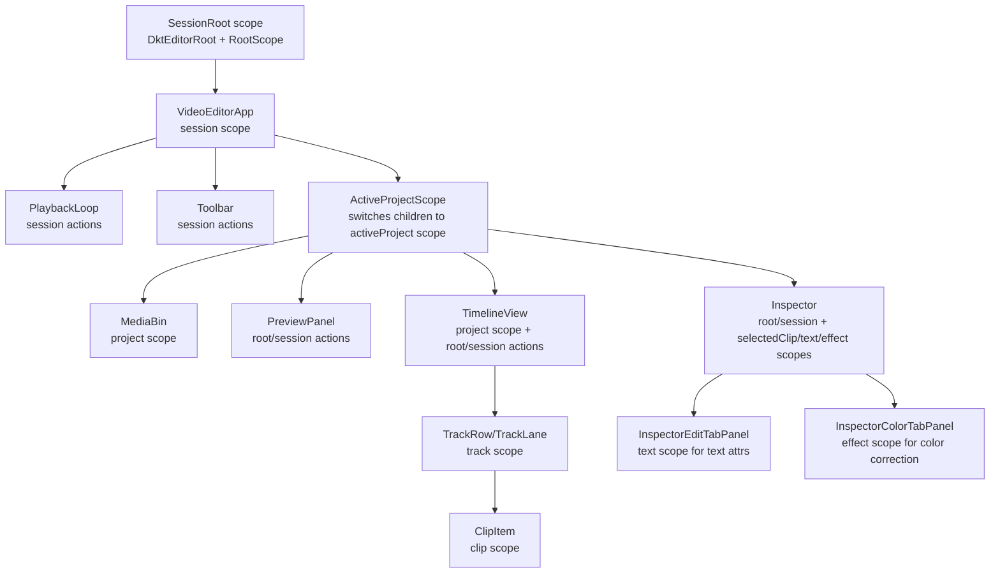

# Render Tree Action Coverage

Date: 2026-05-10

## Current Status

The action matrix is implemented as focused model/runtime contract files, not as
one large `render-tree-action-coverage.test.ts` file. The earlier single-file
matrix idea is superseded by:

- `src/video-editor/dkt/models/session-root-action-contracts.test.ts`
- `src/video-editor/dkt/models/project-track-action-contracts.test.ts`
- `src/video-editor/dkt/models/clip-action-contracts.integration.test.ts`
- `src/video-editor/dkt/models/text-effect-resource-action-contracts.test.ts`
- `src/video-editor/dkt/models/track-clip-rel.test.ts`
- `src/video-editor/dkt/models/split-clip-saga.test.ts`
- `src/video-editor/dkt/models/addResourceToTimeline-appendStart.test.ts`
- `src/video-editor/dkt/models/resource-node-id-routing.test.ts`
- thin UI wiring: `src/video-editor/components/renderTreeActionWiring.test.tsx`

For graph mutations, these tests should use `expectProjectGraphInvariants(ctx)`
as the post-condition gate. New tests should route identity through DKT `_node_id`
or model refs, not through `source*Id` compatibility fields.

## Render Tree



## Scopes And Dispatch Sites

| UI component | Scope | Dispatch actions | Coverage |
| --- | --- | --- | --- |
| `PlaybackLoop` | `SessionRoot` | `startPreviewBuffer`, `tickPlayback` | unit: `SessionRoot/actions.test.ts` for reducers; runtime coverage partial |
| `Toolbar` | `SessionRoot` | create/import/export style session actions | partial: session/import/export tests cover model paths; component coverage not complete |
| `PreviewPanel` | `SessionRoot` | playback/cursor/export actions | partial: session/export tests; component coverage not complete |
| `MediaBin` | `Project` | `requestImportFiles`, resource/timeline actions | unit/runtime: `importTasks.test.ts`, `Project/effects.test.ts`; component coverage partial |
| `TimelineView` | `SessionRoot` + `Project` | `setCursor`, `zoomTimeline`, `splitSelectedClip`, `nudgeSelectedClip`, `deleteSelectedClip`, `addTrack` | unit/model: `split-clip-saga.test.ts`, `timelineActions.test.ts`; component coverage partial |
| `TrackLabel` / `TrackLane` | `Track` | track labels read track attrs; clip children dispatch in clip scope | unit/model: `Track/actions.test.ts`; component coverage partial |
| `ClipItem` | `Clip` + `SessionRoot` | `selectEntity`, `moveBy`, `resize`, `splitSelfAt` | unit/model: `clip-action-contracts.test.ts`, `split-clip-saga.test.ts`; component coverage partial |
| `Inspector` | `SessionRoot` | `setActiveInspectorTab` | unit: session reducer/action coverage |
| `InspectorClipHeader` | `Clip` | `rename` | unit: clip reducer coverage; component coverage not complete |
| `InspectorEditTabPanel` | `Clip` / `Text` | `setTransform`, `updateOpacity`, `setFade`, `setTextContent`, `setTextStyle`, `setTextBox` | unit: clip/text actions; component coverage partial |
| `InspectorAudioTabPanel` | `Clip` | `setAudio` | unit: clip reducer coverage |
| `InspectorColorTabPanel` | `Clip` / `Effect` | `addEffect`, `setEffectParams`, `setEffectEnabled`, `removeEffect` | unit: `effectActions.test.ts`; component coverage partial |
| `renderExportTaskExecutor` | `SessionRoot` via DKT port | `setExportProgress`, `consumeExportRequest` | unit/runtime: export request/runtime tests |

## Model Actions In Render Tree

| Scope/model | Actions | Test status |
| --- | --- | --- |
| `SessionRoot` | `handleInit`, `createProject`, `selectEntity`, `setActiveProject`, `setActiveInspectorTab`, `setCursor`, `setPlaying`, `setTimelineZoom`, `tickPlayback`, `togglePlayback`, `zoomTimeline`, `startPreviewBuffer`, `clearPreviewBuffer` | partial to covered by `sessionActions.test.ts`, `SessionRoot/actions.test.ts`, runtime tests |
| `SessionRoot` | `requestImportFiles` | covered by `importTasks.test.ts` and runtime tests |
| `SessionRoot` | `requestProjectExport`, `requestClipExport`, `requestSelectedClipExport`, `consumeExportRequest`, `setExportProgress`, `clearExportProgress` | covered/partial by export request/runtime tests |
| `SessionRoot` | `addTextClipToTimeline`, `splitSelectedClip`, `nudgeSelectedClip`, `deleteSelectedClip` | covered by model saga tests after this change |
| `Project` | `handleInit`, `renameProject`, `setProjectFormat`, `setProjectDuration`, `addTrack`, `requestImportFiles`, `setImportProgress`, `importResource`, `addResourceToTimeline`, `addTextClipToVideoTrack`, `addClipToVideoTrack`, `addClipToAudioTrack`, `setTracks`, `setResources` | partial to covered by project/import/addResource tests; not every action has direct unit coverage |
| `Track` | `renameTrack`, `setTrackMuted`, `setTrackLocked`, `addClip`, `addTextClip`, `splitClipAt`, `setClips`, `removeClip`, `removeClipBySourceId` | partial to covered by `Track/actions.test.ts`, track rel tests, split/delete saga tests |
| `Clip` | `rename`, `color`, `updateOpacity`, `setClipAttrs`, `setMediaKind`, `setFade`, `setAudio`, `setTimelineAttrs`, `setTransform`, `moveBy`, `trim`, `resize`, `splitAt`, `splitSelfAt`, `removeSelf` | reducer/model coverage exists for timeline/edit/split/delete; relation setters have lower direct coverage |
| `Clip` | `addEffect`, `removeEffect`, `reorderEffect`, `setResource`, `setText`, `setTrack`, `setProject`, `setEffects` | partial: effect flow covered; relation setter coverage is sparse |
| `Effect` | `setEffectName`, `setEffectKind`, `setEffectEnabled`, `setEffectAmount`, `setEffectParams`, `setEffectColor`, `setEffectClip`, `setEffectProject` | partial: reducer/action tests cover common inspector path |
| `Text` | `setTextContent`, `setTextStyle`, `setTextBox`, `setClip` | covered/partial by `textActions.test.ts` |
| `Resource` | `renameResource`, `setResourceStatus`, `setResourceAttrs`, `requestAddToTimeline`, `setProject`, `setClips` | partial: resource effects/transfer tests; direct action coverage is not complete |

## Dispatch Option Note

`sub_flow` is the current forwarding option name. `inline_subwalker` appears in existing code but is a legacy alias and should not be introduced in new action definitions.

## Current Gaps

- Component-level tests do not cover every dispatch button/control in the render tree.
- Direct model coverage is strongest for timeline clip actions, split/delete, import/export, and text/effect reducers.
- Relation setter actions such as `Clip.setResource`, `Clip.setText`, `Effect.setEffectProject`, and `Resource.setClips` are mostly covered indirectly, not with focused unit tests.
- `Track.renameTrack`, `setTrackMuted`, and `setTrackLocked` have reducer logic but should get explicit unit tests if track controls become editable UI.

## Historical Full Action Coverage Plan

The section below is the original audit/plan. Treat it as historical context.
The active implementation shape is the focused-file matrix listed above.

Recommendation: cover render-tree actions first with DKT model/runtime integration tests, not UI/jsdom tests. The contract that matters is: dispatch action -> DKT flow/sub-flow/effect request runs -> final attrs/rels/output state are correct. UI tests should be a smaller second layer that only verifies buttons dispatch the intended action.

### 1. Build A Shared Model Integration Harness

- Extend `src/video-editor/dkt/testingInit.ts` or add a sibling helper that creates:
  - `SessionRoot`
  - active project
  - default video/audio tracks
  - seeded resources, clips, text nodes, and effects
  - helpers: `dispatchAndSettle(scope, action, payload)`, `readAttrs(scope, keys)`, `readRel(scope, rel)`, `findClipBySourceId(track, id)`, `findResourceBySourceId(project, id)`
- Keep all tests in Vitest node/jsdom-free style where possible. These tests should not render React.
- Add one assertion helper per scope:
  - `expectSessionState`
  - `expectProjectState`
  - `expectTrackClips`
  - `expectClipState`
  - `expectEffectState`
  - `expectTextState`

### 2. Create A Single Action Matrix Test File

- Superseded: do not add one large `src/video-editor/dkt/models/render-tree-action-coverage.test.ts`.
- Use the focused files listed in Current Status.
- Structure it by scope, not by UI component:
  - `SessionRoot actions`
  - `Project actions`
  - `Track actions`
  - `Clip actions`
  - `Effect actions`
  - `Text actions`
  - `Resource actions`
- Each test should dispatch the public action name used by the render tree or model forwarding chain, then assert final graph state.
- Avoid testing only pure reducers for this matrix; reducer tests remain useful, but this file should catch broken rel paths, `$output`, `sub_flow`, refs, and computed rels.

### 3. SessionRoot Action Tests

- `handleInit`: bootstraps a project when no active project exists; does not duplicate when active project exists.
- `createProject`: creates project, sets `activeProject`, clears selection and cursor.
- `setActiveProject`: switches `activeProject`, clears selected entity and cursor.
- `selectEntity`: sets and clears `selectedEntityId`; computed `selectedClip` resolves when id matches a clip.
- `setActiveInspectorTab`: accepts valid tabs, rejects invalid payload without mutation.
- `setCursor`: clamps and rounds cursor.
- `setPlaying`, `togglePlayback`: update `isPlaying`.
- `setTimelineZoom`, `zoomTimeline`: clamp to min/max.
- `startPreviewBuffer`, `tickPlayback`, `clearPreviewBuffer`: create, advance, refill, and clear preview buffer.
- `addTextClipToTimeline`: forwards to active project/video track, creates clip + text, selects new clip.
- `nudgeSelectedClip`: forwards to selected clip `moveBy`.
- `splitSelectedClip`: forwards to selected clip `splitSelfAt` and creates right clip.
- `deleteSelectedClip`: forwards to selected clip `removeSelf` and clears selection.
- `requestImportFiles`: updates project import request/output and calls import fx payload path.
- `requestProjectExport`, `requestClipExport`, `requestSelectedClipExport`: create `exportRequest`, `exportProgress`, and `$fx_renderExport` payload with correct range/queue key.
- `consumeExportRequest`, `setExportProgress`, `clearExportProgress`: update or clear export state, including id mismatch no-op.

### 4. Project Action Tests

- `handleInit`: creates default video/audio tracks once.
- `renameProject`, `setProjectFormat`, `setProjectDuration`: update project attrs and reject invalid payloads.
- `addTrack`: creates track with rel back to project and appends to `tracks`.
- `requestImportFiles`: stores import request/progress state expected by import executor.
- `setImportProgress`: normalizes progress and clears invalid/null state as intended.
- `importResource`: creates resource, appends to `resources`, emits `$output` for downstream add-to-timeline flow.
- `addResourceToTimeline`: resolves resource by DKT `_node_id`, chooses video/audio track, creates clip with correct resource rel, kind, start, and duration.
- `addTextClipToVideoTrack`: creates text clip and text node on primary video track.
- `addClipToVideoTrack`, `addClipToAudioTrack`: route clips to the correct primary track.
- `setTracks`, `setResources`: replace rel lists with supplied refs and tolerate invalid payloads.

### 5. Track Action Tests

- `renameTrack`, `setTrackMuted`, `setTrackLocked`: mutate attrs and no-op invalid payloads.
- `addClip`: creates clip, appends to `clips`, sets clip `track` rel.
- `addTextClip`: creates clip + text node, appends clip, sets clip `track` rel.
- `splitClipAt`: creates right-side clip with correct start/in/duration and parent track rel.
- `setClips`: replaces clips rel with supplied refs.
- `removeClip`: removes by DKT node id and is idempotent for missing id.
- `removeClipBySourceId`: removes by source clip id using the explicit source id dependency list and is idempotent for missing id.

### 6. Clip Action Tests

- `rename`, `color`, `updateOpacity`, `setMediaKind`: update attrs and reject invalid payloads.
- `setClipAttrs`: replaces full clip attrs with normalized defaults for missing fields.
- `setFade`, `setAudio`, `setTimelineAttrs`, `setTransform`: update edit attrs and clamp/normalize where required.
- `moveBy`, `trim`, `resize`, `splitAt`: update timeline attrs with bounds and rounding.
- `splitSelfAt`: full saga: shrink left clip, create right clip on track, clear scratch attr.
- `removeSelf`: removes clip from parent track.
- `addEffect`: creates effect, appends to `effects`.
- `removeEffect`, `reorderEffect`: update effect rel list and no-op safely for missing ids.
- `setResource`, `setText`, `setTrack`, `setProject`, `setEffects`: set relation refs and can clear/replace where supported.

### 7. Effect, Text, And Resource Action Tests

- `Effect`: cover `setEffectName`, `setEffectKind`, `setEffectEnabled`, `setEffectAmount`, `setEffectParams`, `setEffectColor`, `setEffectClip`, `setEffectProject`.
- `Text`: cover `setTextContent`, `setTextStyle`, `setTextBox`, `setClip`.
- `Resource`: cover `renameResource`, `setResourceStatus`, `setResourceAttrs`, `requestAddToTimeline`, `setProject`, `setClips`.
- For relation actions, assert both the rel read and any computed state that depends on it.

### 8. Negative And Idempotency Pass

- For every action with validation, add at least one invalid payload case.
- For destructive actions (`removeClip`, `removeClipBySourceId`, `removeSelf`, `removeEffect`) add missing-id or repeated-dispatch cases.
- For forwarding actions, add missing target cases:
  - no active project
  - no selected clip
  - selected id points to a missing clip
  - track/resource rel missing

### 9. Keep UI Tests Thin

- After model/runtime coverage is complete, add a small React test layer only for dispatch wiring:
  - Timeline buttons call `splitSelectedClip`, `nudgeSelectedClip`, `deleteSelectedClip`.
  - Inspector controls call expected clip/text/effect actions.
  - Toolbar/import/export controls call expected session/project actions.
- These tests can mock `useActions`/runtime dispatch and should not duplicate model behavior assertions.

### 10. Completion Criteria

- Every action listed in this document has at least one model/runtime integration test.
- Every action used directly by render-tree UI has either:
  - model/runtime integration coverage for behavior, and
  - thin UI dispatch coverage for the button/control, or an explicit note that it is invoked only programmatically.
- CI command includes the new action coverage test file under `npm run test:video-editor`.
- The matrix in this document is updated from `partial`/`gap` to `covered` only after tests exist.

## Revised Implementation Plan

This section narrows the full matrix into an implementation plan that is easier
to execute and maintain. The document above remains the coverage audit. The
implementation below is the recommended way to turn it into tests.

### Coverage Grouping

Do not create one giant test file that covers every action in the system. Group
tests by model scope and by the kind of contract they protect:

1. **SessionRoot action contracts**
   - user-level editor state: active project, selected entity, inspector tab,
     cursor, playback, timeline zoom;
   - forwarding actions from root/session UI to project or selected clip;
   - import/export request state and `$fx_*` payloads.

2. **Project action contracts**
   - project metadata and format;
   - default track creation;
   - resource import graph;
   - add-resource-to-timeline routing between video/audio tracks;
   - text clip creation from project scope.

3. **Track action contracts**
   - track attrs: name, muted, locked;
   - clip list mutations;
   - clip creation;
   - split-right creation;
   - idempotent removal by node id and by `sourceClipId`.

4. **Clip action contracts**
   - timeline edits: move, trim, resize, split;
   - clip edit attrs: opacity, fade, audio, transform, media kind;
   - full `splitSelfAt` saga;
   - `removeSelf`;
   - effect list actions.

5. **Effect/Text/Resource focused contracts**
   - only actions that are used by the render tree or are needed by graph
     invariants;
   - relation setters get focused tests only when they protect a real boundary:
     render data, parent/child graph consistency, or a previous regression.

6. **Thin UI dispatch wiring**
   - small React tests after model/runtime behavior is covered;
   - verify that visible controls dispatch the intended action from the intended
     scope;
   - do not duplicate graph-state assertions already covered by model tests.

### Files To Create

Create focused files instead of a single `render-tree-action-coverage.test.ts`:

```text
src/video-editor/dkt/models/session-root-action-contracts.test.ts
src/video-editor/dkt/models/project-action-contracts.test.ts
src/video-editor/dkt/models/track-action-contracts.test.ts
src/video-editor/dkt/models/clip-action-contracts.test.ts
src/video-editor/dkt/models/effect-text-resource-contracts.test.ts
src/video-editor/dkt/models/action-contract-test-harness.ts
```

Optional UI wiring tests, added only after the model/runtime layer is green:

```text
src/video-editor/components/__tests__/timeline-dispatch-wiring.test.tsx
src/video-editor/components/__tests__/inspector-dispatch-wiring.test.tsx
src/video-editor/components/__tests__/toolbar-dispatch-wiring.test.tsx
src/video-editor/components/__tests__/media-bin-dispatch-wiring.test.tsx
```

Do not add browser Playwright files for action coverage. Browser tests should
stay focused on real browser/system boundaries: media playback, export,
layout, P2P, download behavior.

### Shared Harness Shape

Create `src/video-editor/dkt/models/action-contract-test-harness.ts`.

The harness should wrap `bootDktModels()` and expose deterministic graph setup
for action tests:

```ts
type ActionContractHarness = {
  ctx: DktTestContext
  sessionRoot: ModelHandle
  project: ModelHandle
  videoTrack: ModelHandle
  audioTrack: ModelHandle
  videoClip: ModelHandle
  audioClip: ModelHandle
  imageResource: ModelHandle
  videoResource: ModelHandle
  audioResource: ModelHandle
  textClip?: ModelHandle
  text?: ModelHandle
  effect?: ModelHandle
  exportRequests: unknown[]
  importRequests: unknown[]
}
```

Required helpers:

```ts
export const createActionContractHarness = async (options?: {
  withText?: boolean
  withEffect?: boolean
  interfaces?: Record<string, unknown>
}): Promise<ActionContractHarness>

export const dispatchAndSettle = async (
  ctx: DktTestContext,
  scope: ModelHandle,
  actionName: string,
  payload?: unknown,
) => {
  await ctx.lockToRead(async () => {
    await scope.dispatch(actionName, payload)
  })
}

export const readSourceIds = async (
  ctx: DktTestContext,
  scope: ModelHandle,
  relName: string,
  sourceAttr: string,
): Promise<string[]>

export const findBySourceId = async (
  ctx: DktTestContext,
  scope: ModelHandle,
  relName: string,
  sourceAttr: string,
  sourceId: string,
): Promise<ModelHandle | null>
```

The harness must use deterministic ids:

```text
project: coverage-project
video track: coverage-project:track:video
audio track: coverage-project:track:audio
video resource: res:video
audio resource: res:audio
image resource: res:image
video clip: clip:video
audio clip: clip:audio
text clip: clip:text
text: text:main
effect: effect:grade
```

### Test Environment

Use the node DKT test environment for all action contract files.

Command while implementing:

```bash
cmd /c npm.cmd run test:video-editor:node -- src/video-editor/dkt/models/session-root-action-contracts.test.ts
```

Broader command:

```bash
cmd /c npm.cmd run test:video-editor:node -- src/video-editor/dkt/models/*action-contracts.test.ts
```

Configuration:

- config: `vitest.video-editor.node.config.js`;
- environment: `node`;
- no React;
- no Testing Library;
- no browser APIs;
- no jsdom;
- no real file IO;
- no WebCodecs/canvas/export rendering.

Bootstrap requirements:

- use `bootDktModels()` from `src/video-editor/dkt/testingInit.ts`;
- keep `sync_sender: false`;
- keep `proxies: false`;
- keep `warnUnexpectedAttrs: false`;
- expose fake `interfaces` only for `$fx_*` action tests.

Required `bootDktModels` extension:

```ts
export const bootDktModels = async (options: {
  interfaces?: Record<string, unknown>
} = {}): Promise<DktTestContext> => {
  const inited = await runtime.start({
    App: MiniCutAppRoot,
    interfaces: options.interfaces ?? {},
  })

  // existing setup
}
```

Dispatch rule:

- every mutation must go through `ctx.lockToRead`;
- reads happen only after `lockToRead` resolves;
- if an action depends on computed rels produced by a previous action, split
  the scenario into two `dispatchAndSettle` calls.

Example:

```ts
await dispatchAndSettle(ctx, sessionRoot, 'selectEntity', 'clip:video')
await dispatchAndSettle(ctx, sessionRoot, 'splitSelectedClip')

const clips = await readSourceIds(ctx, videoTrack, 'clips', 'sourceClipId')
expect(clips).toContain('clip:video')
expect(clips).toHaveLength(2)
```

### What Each File Should Test

#### `session-root-action-contracts.test.ts`

Test public session/root behavior used by render-tree controls:

- `createProject`
  - creates a project;
  - sets `activeProject`;
  - clears `selectedEntityId`;
  - resets `cursor`;
  - default video/audio tracks exist.

- `setActiveProject`
  - switches active project;
  - clears selection and cursor;
  - does not delete other projects.

- `selectEntity`
  - sets `selectedEntityId`;
  - resolves `selectedClip` when id points to a clip;
  - clearing selection empties `selectedClip`.

- `setActiveInspectorTab`
  - accepts valid tabs;
  - invalid tab is a no-op.

- `setCursor`
  - clamps below zero;
  - rounds according to the cursor contract.

- `setPlaying` / `togglePlayback`
  - update `isPlaying` predictably.

- `setTimelineZoom` / `zoomTimeline`
  - clamp to min/max;
  - delta updates are relative.

- `addTextClipToTimeline`
  - forwards to active project/video track;
  - creates clip + text;
  - selects the new clip.

- `nudgeSelectedClip`
  - selected clip receives `moveBy`;
  - no selected clip is a no-op;
  - invalid delta is a no-op.

- `splitSelectedClip`
  - selected clip receives full `splitSelfAt` saga;
  - right clip appears on the same track;
  - no selected clip is a no-op.

- `deleteSelectedClip`
  - removes selected clip from parent track;
  - clears selection;
  - missing selected target clears selection without graph damage.

- import/export request actions
  - model state first: `exportRequest`, `exportProgress`, import request attrs;
  - fake effect API call second;
  - invalid payloads do not call fake APIs.

#### `project-action-contracts.test.ts`

Test project graph and routing:

- `handleInit`
  - creates exactly one default video track and one default audio track;
  - second dispatch does not duplicate tracks.

- `renameProject`, `setProjectFormat`, `setProjectDuration`
  - valid payload mutates expected attrs;
  - invalid payload preserves previous attrs.

- `addTrack`
  - creates track;
  - appends it to `tracks`;
  - child track has project rel.

- `importResource`
  - creates resource with source id, kind, duration/name metadata;
  - appends resource to project;
  - resource has project rel;
  - invalid payload is no-op.

- `addResourceToTimeline`
  - video/image resources route to video track;
  - audio resources route to audio track;
  - new clip starts at that track's current `appendStart`;
  - `appendStart` becomes max clip end after dispatch;
  - missing resource is no-op.

- `addTextClipToVideoTrack`
  - creates text clip and text node;
  - connects clip -> text and text -> clip if supported;
  - appends clip to primary video track.

- `setTracks`, `setResources`
  - replace rel lists with supplied refs;
  - invalid payloads are no-op.

#### `track-action-contracts.test.ts`

Test track-local mutations:

- `renameTrack`, `setTrackMuted`, `setTrackLocked`
  - update attrs;
  - invalid payloads are no-op.

- `addClip`
  - appends clip;
  - sets clip attrs;
  - sets clip `track` rel;
  - invalid payload no-ops.

- `addTextClip`
  - creates clip + text node;
  - appends clip;
  - sets clip `track` rel.

- `splitClipAt`
  - creates right clip;
  - preserves source resource/text mapping;
  - right `start`, `in`, `duration` follow split invariant;
  - right clip has parent track rel;
  - out-of-bounds split is no-op.

- `setClips`
  - replaces clip rel list.

- `removeClip`
  - removes by node id;
  - missing id is idempotent.

- `removeClipBySourceId`
  - removes by `sourceClipId`;
  - missing id is idempotent;
  - dispatch does not throw when source id dependency list is empty.

#### `clip-action-contracts.test.ts`

Test clip behavior and sagas:

- basic attrs
  - `rename`, `color`, `updateOpacity`, `setMediaKind`;
  - valid payload updates state;
  - invalid payload no-ops or normalizes according to current contract.

- edit attrs
  - `setFade`, `setAudio`, `setTimelineAttrs`, `setTransform`;
  - clamp/merge/preserve omitted fields where intended.

- timeline edits
  - `moveBy` rounds and clamps;
  - `trim` preserves the opposite edge;
  - `resize` mirrors trim behavior;
  - `splitAt` shrinks the left clip only and does not create right clip.

- full saga
  - `splitSelfAt` shrinks left clip;
  - creates right clip on track;
  - right clip keeps resource/source/text/effect-relevant mapping;
  - `splitOriginalDuration` is cleared;
  - out-of-bounds split is no-op.

- deletion
  - `removeSelf` removes from parent track;
  - missing parent track is no-op and does not damage unrelated graph.

- effects
  - `addEffect` creates/appends effect;
  - `removeEffect` removes existing effect;
  - missing effect is no-op;
  - `reorderEffect` changes order without losing ids.

- relation setters
  - test only `setResource`, `setText`, `setTrack`, `setProject`, `setEffects`
    when a render/computed invariant depends on them.

#### `effect-text-resource-contracts.test.ts`

Keep this file focused. It should not become a mechanical setter suite.

Effect:

- `setEffectEnabled`;
- `setEffectAmount`;
- `setEffectParams`;
- `setEffectColor`;
- relation actions only when render data depends on them.

Text:

- `setTextContent`;
- `setTextStyle`;
- `setTextBox`;
- `setClip` only if clip/text graph invariant depends on it.

Resource:

- `renameResource`;
- `setResourceStatus`;
- `setResourceAttrs`;
- `requestAddToTimeline` if it is a render-tree path;
- `setProject` and `setClips` only through graph invariant cases.

### Assertion Style

Prefer domain helpers over loose expectations:

```ts
expect(clipsAfter).toHaveLength(clipsBefore.length + 1)
expectClipTiming(ctx, rightClip, {
  start: splitTime,
  in: before.in + left.duration,
  duration: before.duration - left.duration,
})
expectSameSourceMapping(ctx, beforeClip, rightClip)
await expectProjectGraphInvariants(ctx)
```

Avoid:

```ts
expect(clipsAfter.length).toBeGreaterThanOrEqual(2)
const right = clipsAfter.find((clip) => ctx.getAttr(clip, 'start') === 1)
```

That allows extra clips and identifies the right split by a value that can
coincidentally match.

For relation assertions, check both directions when the graph contract requires
it:

```ts
expect(await readSourceIds(ctx, videoTrack, 'clips', 'sourceClipId'))
  .toContain('clip:video')

expect(await readSourceIds(ctx, videoClip, 'track', 'sourceTrackId'))
  .toEqual(['coverage-project:track:video'])
```

For `$fx_*` assertions:

1. assert model state;
2. assert fake API call count;
3. assert fake API payload;
4. assert invalid/no-target cases do not call fake API.

### UI Dispatch Wiring Layer

Add UI dispatch tests only after the model/runtime files are green.

These tests should verify:

- control is reachable via role/label;
- user interaction uses `userEvent`;
- the expected action name is dispatched;
- the scope is correct.

They should not assert final graph behavior. Example:

```ts
it('split button dispatches splitSelectedClip from session scope', async () => {
  const user = userEvent.setup()
  const runtime = createMockVideoEditorRuntime()

  render(<TimelineView />, { wrapper: runtime.Provider })

  await user.click(screen.getByRole('button', { name: 'Split selected clip' }))

  expect(runtime.dispatches).toContainEqual({
    scope: 'session',
    action: 'splitSelectedClip',
    payload: undefined,
  })
})
```

### Implementation Order

1. Add `action-contract-test-harness.ts`.
2. Add shared assertions for clip timing, split invariant, source mapping, graph
   integrity, and rel source ids.
3. Implement `track-action-contracts.test.ts` for `addClip`, `addTextClip`,
   `splitClipAt`, `removeClipBySourceId`.
4. Implement `clip-action-contracts.test.ts` for timeline edits,
   `splitSelfAt`, `removeSelf`, effects.
5. Implement `session-root-action-contracts.test.ts` for selected clip
   forwarding: nudge, split, delete.
6. Implement `project-action-contracts.test.ts` for resource import and
   timeline routing.
7. Add import/export fake interface tests to `session-root-action-contracts`.
8. Add focused `effect-text-resource-contracts.test.ts`.
9. Add negative/idempotency cases for destructive and forwarding actions.
10. Add thin UI dispatch tests only for controls that remain unprotected by
    existing component tests.

### Completion Criteria For This Plan

- Every action directly used by render-tree UI has model/runtime behavior
  coverage or an explicit note that it is UI-only/local state.
- Every forwarding action has at least one test that proves the target rel path,
  `sub_flow`, refs, and final graph state.
- Every destructive action has an idempotency/missing-target test.
- Import/export request actions assert fake effect payloads without running
  real executors.
- Relation setters are not mechanically tested unless they protect graph
  consistency or render/computed behavior.
- No action contract test uses React, browser APIs, Playwright, or CSS
  selectors.
- UI dispatch tests stay thin and do not duplicate DKT graph assertions.

## Implementation Checklist

### Test Environment

Use the node DKT test environment for the model/runtime integration matrix.

Config:

- Primary command: `cmd /c npm.cmd run test:video-editor:node -- src/video-editor/dkt/models/render-tree-action-coverage.test.ts`
- Config file: `vitest.video-editor.node.config.js`
- Environment: `node`
- Included path: `src/video-editor/dkt/models/**/*.test.ts`
- Aliases:
  - `dkt` -> `tmp/dkt/js/libs/provoda/provoda`
  - `dkt-all` -> `tmp/dkt/js`
  - `@video-editor` -> `src/video-editor`

Do not use React, Testing Library, browser APIs, or jsdom for this matrix. The test subject is the DKT model graph, not rendered UI.

Runtime bootstrap:

- Use `bootDktModels()` from `src/video-editor/dkt/testingInit.ts`.
- It starts `MiniCutAppRoot` with:
  - `sync_sender: false`
  - `proxies: false`
  - `warnUnexpectedAttrs: false`
- It hooks a real `SessionRoot` through `hookSessionRoot`.
- It exposes:
  - `ctx.sessionRoot`
  - `ctx.appModel`
  - `ctx.lockToRead(fn)`
  - `ctx.computed()`
  - `ctx.queryRel(model, relName)`
  - `ctx.getAttr(model, attrName)`

Dispatch/settle rule:

- Every action dispatch in these tests must happen inside `ctx.lockToRead(async () => { await scope.dispatch(action, payload) })`.
- Read attrs/rels only after `lockToRead` resolves.
- If one action depends on computed rels produced by a previous action, use separate `lockToRead` blocks. Example: first `selectEntity`, then in a second block `deleteSelectedClip`.

Effect handling / DKT DI:

- This environment does not run page adapters, browser transport, shared workers, or React effects.
- DKT effect APIs are injected through `runtime.start({ interfaces })`.
- `SessionRoot` declares API effects:
  - `exportRuntime` reads `interfaces.exportRuntime` through `['#exportRuntime']`.
  - `importRuntime` reads `interfaces.importRuntime` through `['#importRuntime']`.
- `$fx_renderExport` calls `interfaces.exportRuntime.requestExport(payload)`.
- `$fx_handleInputFiles` calls `interfaces.importRuntime.requestImportFiles(payload)`.
- Therefore `$fx_*` model-boundary tests should pass fake interfaces and assert the captured payloads.
- Do not test real import file IO, media probing, rendering, object URLs, WebCodecs, canvas, or download behavior in this matrix.
- Existing executor tests should remain separate for `importFilesTaskExecutor`, `renderExportTaskExecutor`, transfer manager, and export renderer.

Required harness change:

```ts
export const bootDktModels = async (options: {
  interfaces?: Record<string, unknown>
} = {}): Promise<DktTestContext> => {
  // ...
  const inited = await runtime.start({
    App: MiniCutAppRoot,
    interfaces: options.interfaces ?? {},
  })
  // ...
}
```

Fake effect APIs:

```ts
const exportRequests: unknown[] = []
const importRequests: unknown[] = []

const ctx = await bootDktModels({
  interfaces: {
    exportRuntime: {
      requestExport: (payload: unknown) => {
        exportRequests.push(payload)
      },
    },
    importRuntime: {
      requestImportFiles: (payload: unknown) => {
        importRequests.push(payload)
      },
    },
  },
})
```

Export effect test shape:

```ts
await ctx.lockToRead(async () => {
  await ctx.sessionRoot.dispatch('requestProjectExport', {
    id: 'export:project',
    initiatedBy: 'test',
  })
})

expect(ctx.getAttr(ctx.sessionRoot, 'exportRequest')).toMatchObject({
  id: 'export:project',
  range: { type: 'project' },
})
expect(ctx.getAttr(ctx.sessionRoot, 'exportProgress')).toMatchObject({
  id: 'export:project',
  stage: 'queued',
})
expect(exportRequests).toHaveLength(1)
expect(exportRequests[0]).toMatchObject({
  request: {
    id: 'export:project',
    range: { type: 'project' },
  },
  queueKey: 'project',
})
```

Import effect test shape:

```ts
await ctx.lockToRead(async () => {
  await ctx.sessionRoot.dispatch('requestImportFiles', {
    inputBatchHandleId: 'batch:1',
  })
})

expect(importRequests).toHaveLength(1)
expect(importRequests[0]).toMatchObject({
  projectId: 'coverage-project',
  inputBatchHandleId: 'batch:1',
  addToTimelineWhenEmpty: true,
})
```

Rules for `$fx_*` assertions:

- Assert model state first (`exportRequest`, `exportProgress`, project import attrs if present).
- Assert fake API call count and payload second.
- For invalid payload/no target tests, assert fake API call count stays unchanged.
- Do not call executors from these tests. Executor behavior belongs in executor-specific tests.

Data fixtures:

- Prefer in-test plain payloads over external fixture files.
- Use deterministic ids:
  - project: `coverage-project`
  - tracks: `${projectId}:track:video`, `${projectId}:track:audio`
  - resources: `res:video`, `res:audio`, `res:image`
  - clips: `clip:video`, `clip:audio`, `clip:text`
  - text: `text:main`
  - effects: `effect:grade`, `effect:blur`, etc.
- Avoid `Date.now()` assertions. When action generates ids internally, assert shape/range/stage and graph changes instead of exact id.

What to mock:

- Nothing for normal model action tests.
- If an effect API must be observed, add a minimal fake interface only in a dedicated runtime/effect test. Do not add browser mocks to the action matrix.

Failure diagnostics:

- Compare scalar ids and attrs, not full model instances.
- For rel assertions, map scopes to source ids first:
  - clips -> `sourceClipId`
  - tracks -> `sourceTrackId`
  - resources -> `sourceResourceId`
  - text -> `sourceTextId`
  - effects -> `sourceEffectId`
- When testing no-op behavior, assert both no throw and unchanged source-id lists.

File layout:

- Main matrix: `src/video-editor/dkt/models/render-tree-action-coverage.test.ts`
- Optional shared helpers after first implementation pass: `src/video-editor/dkt/models/renderTreeActionTestHelpers.ts`
- Keep pure reducer tests in existing files; do not move them into the matrix.

### Test Harness Contract

Create `src/video-editor/dkt/models/render-tree-action-coverage.test.ts` and keep helpers local at first. Extract later only when duplication appears.

Required helpers:

```ts
type SeededGraph = {
  ctx: Awaited<ReturnType<typeof bootDktModels>>
  project: unknown
  videoTrack: unknown
  audioTrack: unknown
  videoClip: unknown
  audioClip: unknown
  textClip: unknown
  text: unknown
  resourceVideo: unknown
  resourceAudio: unknown
  effect: unknown
}
```

Implementation steps:

1. `seedGraph()`:
   - boot DKT models;
   - dispatch `SessionRoot.createProject({ sourceProjectId: 'coverage-project', title: 'Coverage Project', fps: 30, width: 1920, height: 1080, duration: 12 })`;
   - read `activeProject`;
   - find default video/audio tracks by `sourceTrackId`;
   - dispatch `Project.importResource` twice:
     - video resource: `sourceResourceId: 'res:video', kind: 'video', name: 'Video Resource', duration: 10`;
     - audio resource: `sourceResourceId: 'res:audio', kind: 'audio', name: 'Audio Resource', duration: 8`;
   - dispatch `Track.addClip` for a video clip: `sourceClipId: 'clip:video', sourceResourceId: 'res:video', mediaKind: 'video', start: 1, in: 0, duration: 4`;
   - dispatch `Track.addClip` for an audio clip on audio track: `sourceClipId: 'clip:audio', sourceResourceId: 'res:audio', mediaKind: 'audio', start: 0, in: 0, duration: 3`;
   - dispatch `Track.addTextClip` for a text clip: `sourceClipId: 'clip:text', sourceTextId: 'text:main', mediaKind: 'text', start: 2, duration: 5`;
   - find created clips and text;
   - dispatch `Clip.addEffect({ sourceEffectId: 'effect:grade', kind: 'color-correction', name: 'Grade' })` on video clip;
   - return all handles.
2. `dispatchAndSettle(scope, action, payload?)`:
   - wrap `scope.dispatch(action, payload)` in `ctx.lockToRead`;
   - await it;
   - do not read state before `lockToRead` completes.
3. `attrs(scope, keys)`:
   - return a keyed object using `ctx.getAttr`.
4. `rel(scope, name)`:
   - return `await ctx.queryRel(scope, name)`.
5. `findByAttr(scopes, key, expected)`:
   - return first scope whose `ctx.getAttr(scope, key) === expected`.
6. `sourceIds(scopes, key = 'sourceClipId')`:
   - return `scopes.map((scope) => ctx.getAttr(scope, key))`.

Common assertions:

- Never compare whole DKT model objects in failure-heavy assertions; compare ids/attrs. Pretty-format can choke on model internals.
- For no-op tests, capture relevant attrs/rels before dispatch, dispatch invalid payload, then compare scalar attrs and rel source ids after dispatch.
- For relation tests, assert both:
  - `await ctx.queryRel(child, 'parentRel')` contains the expected parent;
  - parent rel list contains the child source id.

### SessionRoot Test Cases

| Test | Setup | Dispatch | Assertions |
| --- | --- | --- | --- |
| `createProject creates active project` | `bootDktModels()` only | `sessionRoot.dispatch('createProject', { sourceProjectId: 'p:create', title: 'Created' })` | `activeProjectId === 'p:create'`; `selectedEntityId === null`; `cursor === 0`; `activeProject` rel length `1`; active project title is `Created`; project has default video/audio tracks after `handleInit` sub-flow |
| `createProject appends without deleting existing projects` | create first project, then second | dispatch second `createProject` | pioneer/project rel contains both source ids; `activeProjectId` is second id |
| `setActiveProject switches active project` | two projects exist | `setActiveProject('p:first')` | `activeProjectId === 'p:first'`; `activeProject` rel points to first project; `selectedEntityId === null`; `cursor === 0` |
| `selectEntity resolves selectedClip` | `seedGraph()` | `selectEntity('clip:video')` | `selectedEntityId === 'clip:video'`; `selectedClip` rel source id is `clip:video`; `selectedClipSummary.resourceName` is video clip name |
| `selectEntity null clears selectedClip` | selected clip exists | `selectEntity(null)` or invalid object | `selectedEntityId === null`; `selectedClip` rel empty; `selectedClipSummary === null` |
| `setActiveInspectorTab accepts valid tabs` | `seedGraph()` | dispatch `edit`, `color`, `audio`, `export` one by one | `activeInspectorTab` equals dispatched tab each time |
| `setActiveInspectorTab rejects invalid tab` | capture current tab | `setActiveInspectorTab('bad')` | tab unchanged |
| `setCursor clamps and rounds` | `seedGraph()` | `setCursor(-1)`, then `setCursor(1.239)` | first cursor `0`; second cursor `1.24` |
| `setPlaying and togglePlayback update playback state` | `seedGraph()` | `setPlaying(true)`, `togglePlayback`, `togglePlayback` | states `true`, `false`, `true` |
| `setTimelineZoom clamps` | `seedGraph()` | `setTimelineZoom(1)`, `setTimelineZoom(999)` | zoom equals min then max from session zoom constants |
| `zoomTimeline applies delta and clamps` | set zoom to default | `zoomTimeline(8)`, `zoomTimeline(-999)` | zoom increases by `8`; then clamps to min |
| `startPreviewBuffer creates preview buffer` | seeded clip structure, cursor `0` | `startPreviewBuffer` | `previewBuffer !== null`; buffer start cursor is at or near `0`; contains frame data or expected empty-safe structure |
| `tickPlayback no-ops when paused` | `cursor = 0`, `isPlaying = false` | `tickPlayback({ deltaSeconds: 1 })` | cursor remains `0` |
| `tickPlayback advances when playing` | set `isPlaying = true` | `tickPlayback({ deltaSeconds: 0.5 })` | cursor becomes `0.5`; preview buffer exists or refills if threshold reached |
| `clearPreviewBuffer clears buffer` | start buffer | `clearPreviewBuffer` | `previewBuffer === null` |
| `addTextClipToTimeline creates and selects text clip` | active project only | dispatch payload with `sourceClipId: 'clip:new-text'`, `sourceTextId: 'text:new'` | video track clips include `clip:new-text`; created clip media kind `text`; clip has text rel; `selectedEntityId === 'clip:new-text'` |
| `nudgeSelectedClip moves selected clip` | select `clip:video` | `nudgeSelectedClip({ delta: 0.5 })` | video clip `start` increases by `0.5` |
| `nudgeSelectedClip invalid delta no-ops` | select `clip:video`, capture start | `nudgeSelectedClip({ delta: 0 })`, `nudgeSelectedClip({ delta: 'x' })` | start unchanged |
| `splitSelectedClip creates right clip` | select `clip:video`, set cursor inside clip | `splitSelectedClip` | original duration shrinks; track clip count increases by `1`; right clip start equals cursor; right clip has track rel |
| `splitSelectedClip no selected clip no-ops` | clear selection, capture clips | `splitSelectedClip` | clip source id list unchanged |
| `deleteSelectedClip removes selected clip` | select `clip:video` | `deleteSelectedClip` | video track clip ids do not include `clip:video`; `selectedEntityId === null` |
| `deleteSelectedClip missing selected target only clears selection` | `selectEntity('clip:missing')` | `deleteSelectedClip` | no throw; track clip ids unchanged; selection cleared |
| `requestImportFiles forwards import intent` | active project | `requestImportFiles({ inputBatchHandleId: 'batch:1' })` | project import request/progress attrs match expected queued state; if fx facade is inspectable, queued fx payload has project id and batch id |
| `requestProjectExport creates project export request` | seeded project with clips | `requestProjectExport({ id: 'export:project', initiatedBy: 'test' })` | `exportRequest.id === 'export:project'`; range type `project`; `exportProgress.stage === 'queued'`; plan project id matches active project |
| `requestClipExport creates clip export request` | seeded project | `requestClipExport({ id: 'export:clip', clipId: 'clip:video' })` | range `{ type: 'clip', clipId: 'clip:video' }`; progress queued; invalid clip id no-ops |
| `requestSelectedClipExport uses selected clip` | select `clip:video` | `requestSelectedClipExport({ id: 'export:selected' })` | range clip id is `clip:video`; no selected clip no-ops |
| `setExportProgress normalizes progress` | none | `setExportProgress({ id: 'e1', range: { type: 'project' }, stage: 'rendering', progress: 55.4 })` | `exportProgress.progress === 55.4` or expected normalized percent; stage `rendering` |
| `setExportProgress invalid clears state` | set valid progress first | `setExportProgress({ bad: true })` | `exportProgress === null` |
| `consumeExportRequest only clears matching id` | create export request id `e1` | `consumeExportRequest({ id: 'other' })`, then `consumeExportRequest({ id: 'e1' })` | first keeps request; second clears request |
| `clearExportProgress clears progress` | set progress | `clearExportProgress` | `exportProgress === null` |

### Project Test Cases

| Test | Setup | Dispatch | Assertions |
| --- | --- | --- | --- |
| `handleInit creates default tracks once` | create project without manually adding tracks | `project.dispatch('handleInit')` twice | exactly one video and one audio default track; no duplicates after second dispatch |
| `renameProject updates title` | `seedGraph()` | `renameProject({ title: 'Renamed' })` and `renameProject('Renamed 2')` if supported | title updates; invalid empty/non-string payload no-ops |
| `setProjectFormat updates fps and dimensions` | `seedGraph()` | `setProjectFormat({ fps: 60, width: 1280, height: 720 })` | attrs match; `isLandscape === true`; invalid values preserve previous format |
| `setProjectDuration updates duration` | `seedGraph()` | `setProjectDuration(25)` or payload shape used by model | duration `25`; negative/invalid value no-ops or clamps per model contract |
| `addTrack creates track rel` | `seedGraph()` | `addTrack({ kind: 'video', name: 'V2' })` and `addTrack('audio')` if supported | `tracks` length increases; new track attrs match; new track project rel points to project |
| `requestImportFiles stores request` | `seedGraph()` | `requestImportFiles({ inputBatchHandleId: 'batch:project' })` | project import attrs/output fields match executor expectations |
| `setImportProgress queued/rendering/done/error` | `seedGraph()` | dispatch each valid stage payload | import progress attr has normalized stage/progress/error fields |
| `setImportProgress null clears` | progress set | `setImportProgress(null)` | import progress attr null |
| `importResource creates video resource` | active project | `importResource({ sourceResourceId: 'res:new-video', kind: 'video', name: 'New Video', duration: 6 })` | resources include id; resource attrs set; resource project rel points to project |
| `importResource creates audio resource` | active project | same for `kind: 'audio'` | resources include audio; attrs set |
| `importResource invalid payload no-ops` | capture resource ids | missing `sourceResourceId` | resource ids unchanged |
| `addResourceToTimeline video routes to video track` | resource video exists | `addResourceToTimeline({ sourceResourceId: 'res:video' })` | video track gets new clip; clip `sourceResourceId === 'res:video'`; audio track unchanged |
| `addResourceToTimeline audio routes to audio track` | resource audio exists | `addResourceToTimeline({ sourceResourceId: 'res:audio' })` | audio track gets new clip; media kind audio |
| `addResourceToTimeline missing resource no-ops` | capture track clips | `addResourceToTimeline({ sourceResourceId: 'res:missing' })` | clips unchanged |
| `addTextClipToVideoTrack creates text graph` | active project | dispatch text clip payload | video track clip ids include new id; text rel exists; text attrs match |
| `addClipToVideoTrack creates video clip` | active project | dispatch clip payload | primary video track includes clip; clip track rel points to video track |
| `addClipToAudioTrack creates audio clip` | active project | dispatch clip payload | primary audio track includes clip; clip track rel points to audio track |
| `setTracks replaces track rel list` | create extra tracks | `setTracks({ tracks: [audioTrack] })` | project tracks only contains supplied audio track |
| `setResources replaces resource rel list` | resources exist | `setResources({ resources: [resourceVideo] })` | project resources only contains supplied resource |

### Track Test Cases

| Test | Setup | Dispatch | Assertions |
| --- | --- | --- | --- |
| `renameTrack updates name` | `seedGraph()` | `videoTrack.dispatch('renameTrack', { name: 'Video Main' })` | track name updated; invalid empty payload no-ops |
| `setTrackMuted toggles muted` | `seedGraph()` | `setTrackMuted(true)`, then false | muted attr changes; invalid payload no-ops |
| `setTrackLocked toggles locked` | `seedGraph()` | `setTrackLocked(true)`, then false | locked attr changes; `laneRenderState.locked` follows |
| `addClip appends clip and sets track rel` | video track | `addClip({ sourceClipId: 'clip:add', start: 3, duration: 2, mediaKind: 'video' })` | clips include id; clip attrs match; `clip.track[0] === videoTrack` |
| `addClip invalid payload no-ops` | capture clip ids | missing `sourceClipId` | clip ids unchanged |
| `addTextClip appends clip and creates text` | video track | `addTextClip({ sourceClipId: 'clip:add-text', text: { sourceTextId: 'text:add', content: 'Hello' } })` | clip exists; text rel exists; text content `Hello`; track rel set |
| `splitClipAt creates right split` | video track with source clip attrs | dispatch valid split payload | clip count +1; right clip start/in/duration correct; track rel set |
| `splitClipAt invalid bounds no-ops` | capture clip ids | split outside source bounds | clip ids unchanged |
| `setClips replaces relation` | two clips exist | `setClips({ clips: [firstClip] })` | track clips only first clip |
| `removeClip removes by node id` | clip exists | `removeClip({ clipId: clip._node_id })` or direct node id if available | source ids no longer include removed clip |
| `removeClip missing id idempotent` | capture ids | missing node id twice | ids unchanged; no throw |
| `removeClipBySourceId removes by source id` | clip exists | `removeClipBySourceId({ sourceClipId: 'clip:video' })` | ids do not include `clip:video` |
| `removeClipBySourceId missing id idempotent` | capture ids | missing source id twice | ids unchanged; no throw; action does not trigger `prepareResults` error |

### Clip Test Cases

| Test | Setup | Dispatch | Assertions |
| --- | --- | --- | --- |
| `rename updates name` | video clip | `rename({ name: 'Renamed Clip' })` | name updated; non-string invalid no-ops |
| `color updates color` | video clip | `color({ color: '#ff0000' })` | color attr updated |
| `updateOpacity normalizes percent` | video clip | `updateOpacity({ opacityPercent: 87.4 })` | opacity value rounded to expected tenths |
| `setMediaKind accepts known kinds` | video clip | dispatch `video`, `audio`, `image`, `text` | mediaKind updates; invalid kind no-ops |
| `setClipAttrs replaces normalized attrs` | video clip | dispatch full attrs payload | all target attrs match payload/default fallbacks |
| `setFade clamps to duration` | video clip duration 4 | `setFade({ edge: 'in', delta: 10 })`; `setFade({ edge: 'out', delta: 1 })` | fadeIn <= duration; fadeOut updated; invalid edge no-ops |
| `setAudio updates gain and pan` | audio/video clip | `setAudio({ gain: 0.5, pan: -0.25 })` | audio attr matches with fallback for omitted fields |
| `setTimelineAttrs updates timeline tuple` | video clip | `setTimelineAttrs({ start: 2, in: 1, duration: 3, fadeIn: 0.2, fadeOut: 0.3 })` | start/in/duration/fades match |
| `setTimelineAttrs invalid no-ops` | capture tuple | missing duration | tuple unchanged |
| `setTransform updates transform fields` | video clip | `setTransform({ x: 10, y: -5, scale: 1.5, rotation: 15 })` | transform scalar values match; omitted fields preserve previous values |
| `moveBy rounds and clamps` | clip start 1 | `moveBy({ delta: 2.25 })`, then `moveBy({ delta: -99 })` | start `3.3`, then `0` |
| `trim start preserves end` | clip start/in/duration known | `trim({ edge: 'start', delta: 0.75 })` | end remains previous end; in changes by same delta; duration >= 0.5 |
| `trim end clamps duration` | clip duration 1 | `trim({ edge: 'end', delta: -10 })` | duration `0.5` |
| `resize mirrors trim` | same as trim | dispatch `resize` start/end | same assertions as trim |
| `splitAt shrinks left only` | clip start 1 duration 4 | `splitAt({ time: 2.25 })` | duration becomes rounded split delta; no right clip is created for this local action |
| `splitSelfAt full saga` | clip in track | `splitSelfAt({ time: start + 1 })` | left duration shrinks; right clip created; right `start`, `in`, `duration` correct; `splitOriginalDuration === null` |
| `splitSelfAt out of bounds no-ops` | capture clip ids and duration | split before start/after end | duration and track clip ids unchanged |
| `removeSelf removes from parent track` | clip in track | `removeSelf` | parent track ids do not include source id |
| `removeSelf with missing track no-ops` | create clip without track rel if helper can | `removeSelf` | no throw; no unrelated graph changes |
| `addEffect creates effect rel` | video clip | `addEffect({ sourceEffectId: 'effect:new', kind: 'color-correction' })` | clip effects include id; effect attrs match |
| `removeEffect removes by node id` | clip with effect | `removeEffect({ effectId })` | effects no longer include id |
| `removeEffect missing id no-ops` | capture effect ids | missing id | ids unchanged |
| `reorderEffect changes order` | add two effects | `reorderEffect({ effectId: secondId, toIndex: 0 })` | effect id order changes |
| `setResource sets resource rel` | resource exists | `setResource({ resource })` | `clip.resource[0] === resource`; render data uses resource summary if applicable |
| `setText sets text rel` | text exists | `setText({ text })` | `clip.text[0] === text`; text render attrs appear in clip render data |
| `setTrack sets track rel` | another track exists | `setTrack({ track: audioTrack })` | `clip.track[0] === audioTrack` |
| `setProject sets project rel` | project exists | `setProject({ project })` | `clip.project[0] === project` |
| `setEffects replaces effects rel` | two effects exist | `setEffects({ effects: [effectA] })` | clip effects only contains `effectA` |

### Effect Test Cases

| Test | Setup | Dispatch | Assertions |
| --- | --- | --- | --- |
| `setEffectName updates name` | seeded effect | `setEffectName({ name: 'Primary Grade' })` | name updated; invalid payload no-ops |
| `setEffectKind updates kind` | seeded effect | `setEffectKind({ kind: 'color-correction' })` | kind updated |
| `setEffectEnabled toggles` | seeded effect | `setEffectEnabled({ enabled: false })`, then true | enabled attr follows |
| `setEffectAmount updates amount` | seeded effect | `setEffectAmount({ amount: 0.7 })` | amount updated; invalid no-ops |
| `setEffectParams merges/replaces params per contract` | seeded effect | `setEffectParams({ params: { exposure: { value: 0.5 } } })` | params exposure value updated; unrelated params behavior matches reducer contract |
| `setEffectColor updates color` | seeded effect | `setEffectColor({ color: { lift: '#000000' } })` | color attr updated |
| `setEffectClip sets clip rel` | seeded effect and clip | `setEffectClip({ clip: videoClip })` | effect clip rel points to clip |
| `setEffectProject sets project rel` | seeded effect and project | `setEffectProject({ project })` | effect project rel points to project |

### Text Test Cases

| Test | Setup | Dispatch | Assertions |
| --- | --- | --- | --- |
| `setTextContent updates content` | seeded text | `setTextContent({ content: 'Updated' })` | content updated; invalid payload no-ops |
| `setTextStyle merges style` | seeded text with style | `setTextStyle({ style: { fontSize: 72, color: '#ffffff' } })` | style contains updated values and preserves unspecified fields |
| `setTextBox merges box` | seeded text with box | `setTextBox({ box: { x: 0.2, y: 0.3 } })` | box contains updated values and preserves unspecified fields |
| `setClip sets clip rel` | seeded text and text clip | `setClip({ clip: textClip })` | text clip rel points to text clip |

### Resource Test Cases

| Test | Setup | Dispatch | Assertions |
| --- | --- | --- | --- |
| `renameResource updates name` | seeded resource | `renameResource({ name: 'Renamed Resource' })` | name updated; invalid payload no-ops |
| `setResourceStatus updates status` | seeded resource | `setResourceStatus({ status: 'ready' })`, then error/partial if valid | status updated; invalid status no-ops |
| `setResourceAttrs updates metadata` | seeded resource | `setResourceAttrs({ duration: 15, width: 1280, height: 720, size: 123 })` | attrs updated and normalized |
| `requestAddToTimeline emits request/action path` | seeded resource with project rel | `requestAddToTimeline` | project receives/executes add-to-timeline path if modeled; otherwise assert expected output/request attr |
| `setProject sets project rel` | seeded resource/project | `setProject({ project })` | resource project rel points to project |
| `setClips replaces clips rel` | resource and clips | `setClips({ clips: [videoClip] })` | resource clips rel only contains video clip |

### Execution Order

Implement in this order to keep failures easy to diagnose:

1. Add `seedGraph()` and helper assertions.
2. Add Track tests for `removeClipBySourceId`, `addClip`, `addTextClip`, `splitClipAt`.
3. Add Clip tests for timeline edits, `removeSelf`, `splitSelfAt`, and effect rel actions.
4. Add SessionRoot selected clip tests: `nudgeSelectedClip`, `splitSelectedClip`, `deleteSelectedClip`.
5. Add Project resource/timeline routing tests.
6. Add import/export request tests.
7. Add Effect/Text/Resource relation setter tests.
8. Add no-op/missing-target tests.
9. Only after model/runtime matrix is green, add thin UI dispatch tests if still needed.

Suggested command while implementing:

```bash
cmd /c npm.cmd run test:video-editor:node -- src/video-editor/dkt/models/render-tree-action-coverage.test.ts
```

Suggested broader regression command:

```bash
cmd /c npm.cmd run test:video-editor:node -- src/video-editor/dkt/models/render-tree-action-coverage.test.ts src/video-editor/dkt/models/split-clip-saga.test.ts src/video-editor/dkt/runtime/createMiniCutDktRuntime.splitSelfAt.test.ts
cmd /c npm.cmd run test:video-editor -- src/video-editor/models/Track/actions.test.ts src/video-editor/dkt/models/clip-action-contracts.test.ts src/video-editor/dkt/timelineActions.test.ts
```
