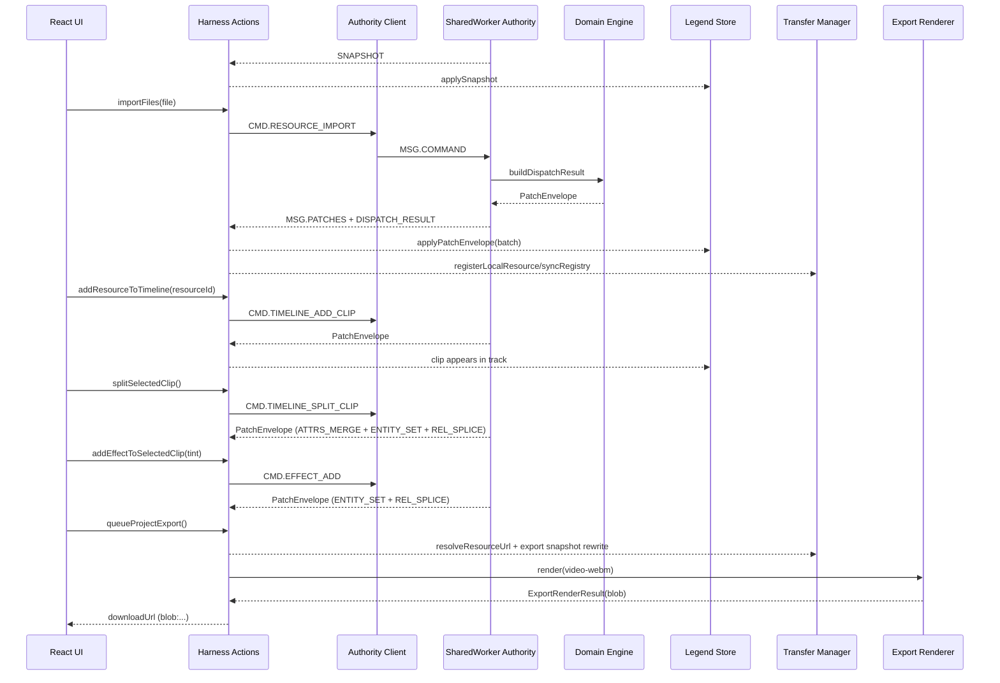

# MiniCut Runtime Trace (Import -> Timeline -> Patches -> Cut -> Effect -> Export -> File)

## Purpose

This document is a concrete runtime walkthrough of one real editing path, with direct links to implementation points.

Scenario:
1. Import media file.
2. Add it to timeline as a clip.
3. Observe patch stream and replica updates.
4. Cut (split) the clip.
5. Add an effect.
6. Export project.
7. Receive downloadable file.

## End-to-End Sequence (Compact)



## Step 0: Bootstrap Snapshot and Replica Subscription

Entry points:
- [src/video-editor/app/createVideoEditorHarness.ts](../src/video-editor/app/createVideoEditorHarness.ts)
- [src/video-editor/worker/sharedWorker.ts](../src/video-editor/worker/sharedWorker.ts)
- [src/video-editor/legend/projectStore.ts](../src/video-editor/legend/projectStore.ts)

What happens:
- Harness calls `bootstrapSnapshot()` then `authorityClient.getSnapshot()`.
- Snapshot is applied with `applySnapshot(projects$, snapshot)`.
- Harness subscribes to authority patches via `authorityClient.subscribe(...)`.
- Every incoming envelope is applied by `applyPatchEnvelope(projects$, envelope)`.

Why it matters:
- The page replica is always reconstructed from authority state first, then maintained by patch stream.

## Step 1: Import File

Entry points:
- [src/video-editor/app/createVideoEditorHarness.ts](../src/video-editor/app/createVideoEditorHarness.ts)
- [src/video-editor/domain/types.ts](../src/video-editor/domain/types.ts)
- [src/video-editor/domain/applyCommand.ts](../src/video-editor/domain/applyCommand.ts)

Action path:
- UI calls `actions.importFiles(files)`.
- Harness computes media kind and duration, then dispatches `CMD.RESOURCE_IMPORT`.
- Worker handles `MSG.COMMAND`, runs `buildDispatchResult`, applies envelope in-place, and broadcasts `MSG.PATCHES`.

Representative command payload:

```json
{
  "c": "CMD.RESOURCE_IMPORT",
  "p": {
    "projectId": "project:1",
    "name": "clip.webm",
    "kind": "video",
    "duration": 12.7,
    "mime": "video/webm",
    "size": 7340032
  }
}
```

Representative patch envelope shape:

```json
{
  "patches": [
    { "c": "PATCH.ENTITY_SET", "p": { "entity": "resource" } },
    { "c": "PATCH.REL_SPLICE", "p": { "id": "projectRoot", "rel": "resources" } }
  ]
}
```

Transfer side effects:
- Harness calls `resourceTransferManager.registerLocalResource(...)`.
- Harness calls `resourceTransferManager.syncRegistry(...)` after patch apply.

## Step 2: Add Resource to Timeline

Entry points:
- [src/video-editor/app/createVideoEditorHarness.ts](../src/video-editor/app/createVideoEditorHarness.ts)
- [src/video-editor/domain/applyCommand.ts](../src/video-editor/domain/applyCommand.ts)

Action path:
- `actions.addResourceToTimeline(resourceId)` dispatches `CMD.TIMELINE_ADD_CLIP`.
- Domain creates clip entity and appends clip id to target track with `REL_SPLICE`.
- For video resources with linked audio enabled, domain may create a second audio clip.

Representative patch sequence:

```json
[
  { "c": "PATCH.ENTITY_SET", "p": { "entity": "clip" } },
  { "c": "PATCH.REL_SPLICE", "p": { "id": "track:v1", "rel": "clips", "insert": ["clip:1"] } }
]
```

## Step 3: Serial Patch Application on Page Replica

Entry points:
- [src/video-editor/worker/sharedWorker.ts](../src/video-editor/worker/sharedWorker.ts)
- [src/video-editor/app/createVideoEditorHarness.ts](../src/video-editor/app/createVideoEditorHarness.ts)
- [src/video-editor/legend/projectStore.ts](../src/video-editor/legend/projectStore.ts)

Runtime behavior:
- Worker mutates authoritative registry via `applyPatchEnvelopeInPlace(...)`.
- Worker broadcasts each resulting envelope to connected ports.
- Harness applies each envelope to Legend store with `applyPatchEnvelope(...)`.
- UI updates reactively from store changes.

Note:
- Runtime ordering is serial per authority stream (command-by-command envelope broadcast).

## Step 4: Cut Clip (Split)

Entry points:
- [src/video-editor/app/createVideoEditorHarness.ts](../src/video-editor/app/createVideoEditorHarness.ts)
- [src/video-editor/domain/applyCommand.ts](../src/video-editor/domain/applyCommand.ts)

Action path:
- `actions.splitSelectedClip()` dispatches `CMD.TIMELINE_SPLIT_CLIP` at cursor time.
- Domain validates split bounds and produces:
  - `PATCH.ATTRS_MERGE` for left clip duration,
  - `PATCH.ENTITY_SET` for right clip,
  - `PATCH.ENTITY_SET` clones for effects on the right clip,
  - `PATCH.REL_SPLICE` to insert right clip after left clip.

Representative patch sequence:

```json
[
  { "c": "PATCH.ATTRS_MERGE", "p": { "id": "clip:1", "attrs": { "duration": 2.4 } } },
  { "c": "PATCH.ENTITY_SET", "p": { "entity": "clip:2" } },
  { "c": "PATCH.REL_SPLICE", "p": { "id": "track:v1", "index": 1, "insert": ["clip:2"] } }
]
```

## Step 5: Add Effect

Entry points:
- [src/video-editor/app/createVideoEditorHarness.ts](../src/video-editor/app/createVideoEditorHarness.ts)
- [src/video-editor/domain/applyCommand.ts](../src/video-editor/domain/applyCommand.ts)

Action path:
- `actions.addEffectToSelectedClip(kind)` dispatches `CMD.EFFECT_ADD`.
- Domain creates `effect` entity and appends effect id into `clip.rels.effects`.

Representative patch sequence:

```json
[
  { "c": "PATCH.ENTITY_SET", "p": { "entity": "effect:1" } },
  { "c": "PATCH.REL_SPLICE", "p": { "id": "clip:2", "rel": "effects", "insert": ["effect:1"] } }
]
```

## Step 6: Export Project

Entry points:
- [src/video-editor/app/createVideoEditorHarness.ts](../src/video-editor/app/createVideoEditorHarness.ts)
- [src/video-editor/media/resourceTransferManager.ts](../src/video-editor/media/resourceTransferManager.ts)
- [src/video-editor/render/exportRenderer.ts](../src/video-editor/render/exportRenderer.ts)
- [src/video-editor/render/exportTypes.ts](../src/video-editor/render/exportTypes.ts)

Action path:
- UI calls `actions.queueProjectExport()`.
- Harness builds export snapshot via `createExportRegistrySnapshot(...)`.
- For ready transferred resources, harness rewrites resource URL using `resourceTransferManager.resolveResourceUrl(...)`.
- Harness calls `exportRenderer.render(request, onProgress?)`.
- Browser renderer attempts WebCodecs path first, then MediaRecorder fallback when needed.

Progress stages:
- `queued`
- `rendering`
- `finalizing`
- `done`

## Step 7: Got File

Result path:
- Export renderer returns `ExportRenderResult` with `blob`, `fileName`, `manifest`.
- Harness creates download URL with `URL.createObjectURL(result.blob)`.
- UI receives result containing `downloadUrl` and can trigger save/download.

Representative final result shape:

```json
{
  "id": "export:...",
  "fileName": "project.webm",
  "mimeType": "video/webm",
  "blob": "Blob(...)",
  "downloadUrl": "blob:...",
  "manifest": { "format": "video-webm", "range": { "type": "project" } }
}
```

## Patch Vocabulary Seen in This Scenario

- `PATCH.ENTITY_SET`: resource, clip, effect creation.
- `PATCH.REL_SPLICE`: append/insert in `resources`, `tracks`, `clips`, `effects`.
- `PATCH.ATTRS_MERGE`: clip field updates, split left-side duration.
- Optional `PATCH.SCALAR_SET`: scalar path updates (transform/opacity cases).

## Practical Debug Checklist for This Scenario

1. Snapshot never arrives on startup.
- Check snapshot request/response path in [src/video-editor/worker/sharedWorker.ts](../src/video-editor/worker/sharedWorker.ts).

2. File imported but no timeline clip appears.
- Check auto-add logic in [src/video-editor/app/createVideoEditorHarness.ts](../src/video-editor/app/createVideoEditorHarness.ts) and `CMD.TIMELINE_ADD_CLIP` handling in [src/video-editor/domain/applyCommand.ts](../src/video-editor/domain/applyCommand.ts).

3. Remote preview exists but export uses stale URL.
- Check `createExportRegistrySnapshot(...)` and URL resolution in [src/video-editor/media/resourceTransferManager.ts](../src/video-editor/media/resourceTransferManager.ts).

4. Split/effect operations succeed but UI does not update.
- Check envelope subscription/apply path in [src/video-editor/app/createVideoEditorHarness.ts](../src/video-editor/app/createVideoEditorHarness.ts) and store patch handling in [src/video-editor/legend/projectStore.ts](../src/video-editor/legend/projectStore.ts).
